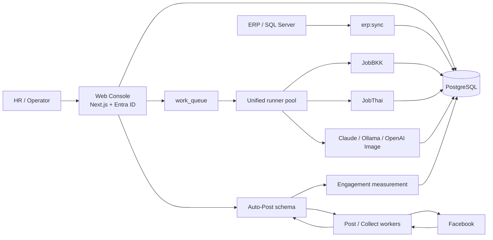

# SO Recruitment Platform — Project Handbook

> ฉบับปรับปรุงจากโค้ดจริง ณ 17 กรกฎาคม 2026
> Repository: `api-scraper`
> กลุ่มผู้อ่าน: Developer, Operator, HR Admin และผู้รับช่วงดูแลระบบ

เอกสารนี้อธิบายระบบปัจจุบันที่อยู่ใน repository นี้ ไม่ใช่เฉพาะ scraper เดิม หากข้อมูลในเอกสารขัดกับโค้ด ให้ยึดลำดับความน่าเชื่อถือดังนี้: **code และ migration → `.env.example` → Handbook → README/DEPLOY เก่า**

---

## 1. Executive summary

โปรเจกต์นี้คือแพลตฟอร์มงานสรรหาที่รวม 4 งานไว้ใน repository เดียว:

1. **Candidate Scraping** — ดึงประวัติผู้สมัครจาก JobBKK และ JobThai, รวมข้อมูลซ้ำ, เก็บไฟล์แนบ และ OCR
2. **So Recruit Web Console** — หน้าจอ Next.js สำหรับดูผู้สมัคร, connector, งาน scraping, quota และดาวน์โหลด resume PDF
3. **Facebook Auto‑Post** — จัดการบัญชี/กลุ่ม/งานโพสต์, เปิด browser โพสต์จริง, เก็บคอมเมนต์และเบอร์โทร
4. **Recruitment Content Orchestrator** — รับใบขอกำลังคนจาก ERP, ให้ AI สร้างข้อความ/รูป, ขออนุมัติ, ส่งไป Auto‑Post และวัด engagement เพื่อวนสร้างเวอร์ชันใหม่

ระบบใช้ PostgreSQL กลางหนึ่งฐานข้อมูล แต่แยก schema เพื่อให้แต่ละโมดูลเสียหายแยกจากกัน:

- `DB_SCHEMA` — ข้อมูลผู้สมัครและ orchestrator; ค่าแนะนำปัจจุบันคือ `so-candidate-data`
- `AUTOPOST_SCHEMA` ใน root/web และ `DB_SCHEMA` ภายใน `autopost/` — ข้อมูล Auto‑Post; ค่าแนะนำปัจจุบันคือ `so_autopost_apiscraper`

Browser worker ต้องรันบนเครื่องหรือ VM ที่เปิดต่อเนื่องและเข้าถึงเว็บเป้าหมายได้ ไม่ควรวางตัว browser bot บน Vercel ส่วน Web Console สามารถรันบน Vercel ได้

---

## 2. ภาพระบบ



แนวคิดสำคัญ:

- Web ทำหน้าที่สั่งงานและอ่านข้อมูล ไม่ควรเปิด browser bot เอง
- `work_queue` รับงาน `scrape`, `draft`, `measure` และล็อกทีละ `connector_key`
- งาน Facebook ใช้ `post_run_queue`/คิวของ Auto‑Post แยกต่างหาก
- ข้อมูลผู้สมัครหนึ่งคนมี canonical row ใน `candidates` และมีหลายแหล่งที่มาใน `candidate_sources`
- ข้อมูลลับของ connector ถูกเข้ารหัสด้วย AES‑256‑GCM ผ่าน `APP_ENCRYPTION_KEY`

---

## 3. โครงสร้าง repository

```text
api-scraper/
├─ src/                     backend scraper, DB, ERP และ orchestrator
│  ├─ api/server.js         Control API แบบ Node HTTP
│  ├─ cli/                  CLI จัดการ connector/utility
│  ├─ connectors/           registry ของ provider
│  ├─ core/                 anti-ban, OCR, AI content, job family, measurement
│  ├─ db/                   pool, repositories, crypto, schema 001–009
│  ├─ erp/                  SQL Server intake และ sync เข้า PostgreSQL
│  ├─ providers/            JobBKK และ JobThai
│  ├─ pipeline.js           scrape connector หนึ่งตัวตั้งแต่ต้นจนจบ
│  └─ tasks-worker.js       scrape → OCR → enrich → adjacent expansion
├─ workers/
│  ├─ runner.js             unified work_queue runner
│  └─ scraper-pool.mjs      autoscale runner ตามจำนวนบัญชี scraper
├─ web/                     Next.js 14 Web Console
│  ├─ app/                  pages และ API routes
│  ├─ components/           UI components
│  └─ lib/                  auth, DB access, server actions, PDF, worker kick
├─ autopost/                Express + Playwright Facebook automation
│  ├─ server/               API, DB layer, comment collector
│  ├─ src/helpers/          login, posting, human behavior, collection
│  ├─ scripts/              workers, migrations, maintenance และ POC
│  ├─ tests/                Playwright/logic tests
│  └─ public/               SPA เดิมของ Auto‑Post
├─ docs/                    runbook และแผนปฏิบัติการเฉพาะเรื่อง
├─ legacy-demo/             prototype เก่า ใช้อ้างอิง selector/flow เท่านั้น
├─ scripts/                 diagnose/test utilities ของระบบหลัก
├─ Dockerfile
├─ docker-compose.yml
├─ start-workers.bat        launcher สำหรับเครื่อง Windows 24 ชั่วโมง
└─ HANDBOOK.md              เอกสารฉบับนี้
```

### ส่วนที่เป็น production path

- ใช้งานใหม่ให้เริ่มที่ `src/`, `workers/`, `web/`, `autopost/`
- `legacy-demo/` ไม่ใช่ entry point สำหรับ production
- สคริปต์ชื่อ `patch-*`, `fix-*`, `assign-*` ใน `autopost/scripts/` เป็น maintenance แบบครั้งเดียว อย่ารันเหมารวม

---

## 4. Technology stack

| ส่วน | เทคโนโลยีหลัก |
|---|---|
| Scraper backend | Node.js ESM, Playwright, Cheerio, PostgreSQL `pg` |
| Web Console | Next.js 14 App Router, React 18, TypeScript, Tailwind, NextAuth |
| Authentication | Microsoft Entra ID / Azure AD, JWT session อายุ 8 ชั่วโมง |
| Auto‑Post | Node.js CommonJS, Express, Playwright Test, PostgreSQL |
| OCR | Ollama + Typhoon OCR; PDF ใช้ `pdftoppm` |
| Content text | Anthropic API หรือ Ollama ภายในบริษัท |
| Content image | OpenAI Images adapter |
| ERP intake | Microsoft SQL Server ผ่าน `mssql` |
| Deployment | Vercel สำหรับ web; Windows worker หรือ Docker/Xvfb สำหรับ browser workers |

Node.js ขั้นต่ำของ root คือ 18 ขึ้นไป เพราะใช้ native `fetch` และ ESM

---

## 5. Candidate scraping flow

### 5.1 จุดเริ่มต้น

งาน scraping ปกติเริ่มจาก Web Console หน้า `/scraping`:

1. ผู้ใช้สร้าง `scrape_tasks`
2. ถ้าเลือก Run now, Web เพิ่มงาน `type='scrape'` เข้า `work_queue`
3. `workers/runner.js` claim งานแบบ atomic
4. ถ้างานมี `ref_id`, runner เรียก `runTask()` ใน `src/tasks-worker.js`
5. `runTask()` เรียก `runConnector()` ใน `src/pipeline.js`

ทางเลือกสำหรับ operator/developer:

- `npm run worker` — scrape connector ที่เปิดใช้งานทั้งหมดหนึ่งรอบ
- `npm run tasks` — ประมวลผล task ที่ queued/due แบบ legacy fallback
- `npm run worker:pool` — unified runner หนึ่ง process
- `npm run scraper:pool` — autoscale unified runner ตามจำนวน connector
- `POST /runs` ที่ Control API — ad-hoc run แบบ asynchronous

### 5.2 สิ่งที่ `runConnector()` ทำ

1. เลือก provider จาก `src/connectors/registry.js`
2. สร้าง `scrape_runs` สถานะ `running`
3. คำนวณ target ที่ต่ำที่สุดจาก:
   - จำนวนที่งานขอ
   - `connectors.scrape_limit`
   - quota รายบัญชี `connectors.daily_cap`
   - quota รวม platform ใน `provider_limits`
4. เปิด session และ reuse `connectors.session_state`
5. login ใหม่เมื่อ session เสีย และบันทึก state กลับ DB
6. ค้นหา resume IDs
7. ดึงรายละเอียดทีละคนตาม random delay
8. parse ข้อมูล, reveal contact ถ้า provider รองรับ, ดาวน์โหลด assets
9. ใน transaction เดียว: dedupe/upsert candidate → upsert source → save assets
10. logout เพื่อคืน active session ให้ platform และปิด browser
11. ปิด `scrape_runs` เป็น `success`, `partial`, `failed` หรือ `cooldown`

ค่าป้องกันการค้างหลัก:

- login timeout เริ่มต้น 5 นาที
- candidate timeout เริ่มต้น 3 นาทีต่อ resume
- relogin ระหว่าง run ได้สูงสุด 8 ครั้ง
- soft-ban cooldown 2 ชั่วโมง

### 5.3 Provider behavior

| Provider | Search/detail | ประเด็นสำคัญ |
|---|---|---|
| JobBKK | ค้นผ่าน browser แบบ headful; detail ใช้ browser session | contact ที่ไม่ mask ต้องมาจาก browser จริง; headless มักติด bot check |
| JobThai | ค้น/detail ผ่าน HTTP ใน Playwright request context | reveal contact ผ่าน AJAX หนึ่งครั้ง และอาจใช้ view quota ของบัญชี |

Provider interface ที่ pipeline คาดหวังประกอบด้วย `getSession`, `searchResumeIds`, `fetchResumeHtml`, `resumeDetailUrl`, `parseResumeHtml`, `collectAssetsForDb`, `externalId` และ optional `enrichContacts`, `logout`, `isResumeAuthBlocked`

### 5.4 Dedupe

ลำดับ match ผู้สมัคร:

1. `phone_norm`
2. `email_norm`
3. `dedupe_key` แบบ `name:<name>:<birth_date>`

เมื่อพบคนเดิม ระบบเติม field ที่มีข้อมูลและ refresh array ที่ไม่ว่าง ไม่สร้าง canonical candidate ใหม่ แต่จะ upsert แหล่งที่มาใน `candidate_sources`

ข้อควรเข้าใจ: source uniqueness คือ `(platform, external_id)` จึงติดตามว่าคนเดียวกันเคยพบจากหลาย platform/connector ได้

### 5.5 Multi-phase task

`runTask()` แสดง progress 3 เฟส:

```text
login/scraping → ocr → enrich → done
```

- **scraping** — ดึงและบันทึก candidate/assets
- **ocr** — อ่าน attachment ที่ `extract_status='pending'`
- **enrich** — เติมเฉพาะ email/phone/line ที่ยังว่างจากข้อความ OCR; ไม่ overwrite ข้อมูลเดิม

### 5.6 Adjacent-position expansion

ถ้า `expand_adjacent=true` และได้คนไม่ครบ target:

1. ส่งตำแหน่งไปจัด Job Family A–F ด้วย Anthropic
2. cache ผลใน `job_family_cache`
3. auto-run เฉพาะ tier สีเขียว
4. บันทึกสีเหลือง/แดงเป็นคำแนะนำใน `scrape_tasks.adjacent_plan`
5. จำกัดรอบด้วย `MAX_ADJACENT_ROUNDS`

ถ้าไม่มี `ANTHROPIC_API_KEY` ฟีเจอร์นี้ปิดตัวเองและงาน scrape หลักยังทำต่อได้

---

## 6. Queue, locking และ concurrency

### 6.1 Unified `work_queue`

Runner ปัจจุบันรองรับ handler:

| type | module | handler |
|---|---|---|
| `scrape` | `scraper` | scrape task หรือ ad-hoc connector |
| `draft` | `orchestrator` | สร้าง content draft + รูป |
| `measure` | `orchestrator` | อ่าน engagement และตัดสินผล |
| `selftest` | utility | ตรวจ plumbing ของคิว |

`post` และ `collect` ยังไม่ได้ลง handler ใน unified runner โดยตั้งใจ งาน Facebook จึงอยู่ในคิวของ Auto‑Post เอง

### 6.2 Per-account lock

`connector_key` มีรูป `<platform>:<id>` เช่น:

```text
jobbkk:<connector-uuid>
jobthai:<connector-uuid>
orchestrator:<campaign-uuid>
```

runner ใช้ `FOR UPDATE SKIP LOCKED` และไม่ claim งานเมื่อ key เดียวกันมีงาน `running` อยู่ ดังนั้น:

- account เดียวไม่ถูกเปิดพร้อมกันสองงาน
- account คนละตัวทำงานขนานได้
- เพิ่มจำนวน runner เพื่อเพิ่ม throughput ข้าม account

งาน `running` ที่ lock เก่ากว่า `WORKER_STALE_SECONDS` จะถูกคืนเป็น `queued`

### 6.3 Worker modes

```powershell
node workers/runner.js           # daemon, poll ต่อเนื่อง
node workers/runner.js --once    # ทำหนึ่งงานแล้วออก
node workers/runner.js --drain   # ทำงานที่รองรับจนคิวว่างแล้วออก
```

Web มี `kickWorker()` เพื่อเรียก `--drain` บนเครื่องที่มี source code แต่ production ยังควรมี persistent runner pool เพราะ Vercel ไม่ใช่เครื่อง browser worker

---

## 7. Auto‑Post flow

Auto‑Post เป็น subsystem ที่ vendored อยู่ใน `autopost/` และมีฐานข้อมูล/worker ของตนเอง

### 7.1 โครงข้อมูลหลัก

- `users` — บัญชี Facebook, credential, cap, pause/circuit-breaker, worker pin
- `groups` — กลุ่ม Facebook
- `jobs` — เนื้อหาที่จะโพสต์
- `assignments` — งาน × กลุ่ม × บัญชี
- `post_run_queue` — คิวรอบโพสต์จริง
- `post_logs` — ผลโพสต์, link, comment, lead, reactions, shares
- `post_schedules` — ตารางเวลา
- `run_logs` — operational logs

หลายตาราง/คอลัมน์ถูก ensure โดย `autopost/server/db.js` ตอน server เริ่ม นอกเหนือจาก `autopost/database/schema.sql`

### 7.2 การรัน

```powershell
cd autopost
npm ci
npm start                  # Express UI/API
npm run worker:post        # supervisor + posting worker
npm run worker:collect     # comment/lead collection worker
```

Posting worker:

- poll API ตาม `WORKER_POLL_MS`
- รันหลายบัญชีพร้อมกันตาม `WORKER_CONCURRENCY`
- มี per-account daily cap, repost gap และ circuit breaker
- schedule รอบอัตโนมัติทุกวันตาม `AUTO_POST_HOUR`, `AUTO_POST_MINUTE`, `AUTO_POST_TZ`
- pin บัญชีกับ `WORKER_NAME` เพื่อให้บัญชีเดิมใช้เครื่อง/IP เดิม

### 7.3 Anti-block controls

- human-like click/type/browse delays
- random delay ระหว่างโพสต์และ batch break
- daily cap รายบัญชี
- หยุดบัญชีเมื่อ fail streak ถึง threshold
- stable session state ใน `autopost/.auth/`
- stable worker/IP ต่อบัญชีผ่าน preferred worker

อย่าเพิ่ม concurrency โดยดูแค่ CPU: Chromium แต่ละตัวใช้ RAM สูง และ Facebook ประเมินทั้งพฤติกรรมบัญชีและ IP

---

## 8. Content Orchestrator flow

```text
ERP request
  → erp_open_requests
  → recruit_campaigns
  → AI draft
  → pending approval
  → approved + Auto-Post queue
  → Facebook posts
  → collect engagement
  → measure
      ├─ high: done + save winning pattern
      ├─ low: enqueue new draft version
      └─ no data: remain measuring
```

### 8.1 ERP intake

`npm run erp:sync` query ใบขอเปิดจาก SQL Server แล้ว upsert เข้า `erp_open_requests` ใน PostgreSQL เพื่อให้ Vercel อ่านได้โดยไม่ต้องต่อ network ภายในโดยตรง

ใบขอที่หายจากผล ERP ล่าสุดจะถูกลบจาก staging เฉพาะรายการที่ยังไม่สร้าง campaign

### 8.2 Draft

เมื่อผู้ใช้สร้าง campaign:

1. Web สร้าง `recruit_campaigns`
2. enqueue `work_queue.type='draft'`
3. runner เรียก `generateDraftForCampaign()`
4. text provider สร้าง caption, video brief และ image prompt
5. image provider สร้างรูปถ้ามี key
6. บันทึก `campaign_contents` version ใหม่
7. campaign เปลี่ยนเป็น `pending_approval`

Text provider:

- `CONTENT_TEXT_PROVIDER=anthropic` ใช้ `ANTHROPIC_API_KEY`
- `CONTENT_TEXT_PROVIDER=ollama` ใช้ `OLLAMA_BASE_URL`
- ถ้าเว้นว่าง ระบบเลือก Anthropic ก่อน ถ้าไม่มี key จึงเลือก Ollama

Image provider ปัจจุบันรองรับ `openai` ผ่าน `OPENAI_API_KEY`; ถ้าไม่มี key draft ยังสำเร็จแต่ไม่มีรูป

### 8.3 Approval และ Auto‑Post bridge

เมื่ออนุมัติพร้อมเลือกบัญชี Facebook, Web สร้าง row ข้าม schema ได้แก่ `jobs`, `assignments`, `post_run_queue` และสร้าง `campaign_posts` ฝั่ง orchestrator เพื่อเก็บ link กลับด้วย `job_ref`

ค่าชื่อ schema ข้ามระบบต้องตรงกัน:

```text
root/web: AUTOPOST_SCHEMA=so_autopost_apiscraper
autopost: DB_SCHEMA=so_autopost_apiscraper
```

### 8.4 Engagement feedback

คะแนนปัจจุบัน:

```text
score = comments + unique_leads × ENGAGE_LEAD_WEIGHT
```

ถ้า score ถึง `ENGAGE_HIGH_SCORE` ถือว่า high และบันทึก content ลง `content_winning_patterns`; ถ้าต่ำทุกโพสต์และไม่มีรายการ pending จะ enqueue draft version ใหม่

Likes และ shares ถูกบันทึกเพื่อแสดงผล แต่ยังไม่อยู่ในสูตร score ปัจจุบัน

---

## 9. Database map

### 9.1 Candidate/orchestrator schema

| ตาราง | หน้าที่ |
|---|---|
| `connectors` | บัญชี provider, encrypted password, session, cap, cooldown |
| `scrape_runs` | execution history ของแต่ละ scrape |
| `candidates` | canonical candidate หลัง dedupe |
| `candidate_sources` | provenance ต่อ platform/external ID/run |
| `candidate_assets` | รูป/เอกสาร bytea และผล OCR |
| `provider_limits` | cap รวมต่อ platform |
| `scrape_tasks` | task, schedule, phase, progress, adjacent plan |
| `work_queue` | unified queue สำหรับ scraper/orchestrator |
| `job_family_cache` | cache adjacent-position AI |
| `erp_open_requests` | staging ใบขอจาก ERP |
| `recruit_campaigns` | campaign ต่อใบขอ |
| `campaign_contents` | draft หลาย version |
| `campaign_posts` | post reference และ engagement |
| `content_winning_patterns` | content ที่ผลดีสำหรับ reuse |

Views:

- `v_connectors` — legacy unified view; หน้า Settings ปัจจุบัน query scraper schema และ `AUTOPOST_SCHEMA` โดยตรงเพื่อรองรับการแยก schema
- `v_contacts` — candidate phone + Facebook leads

### 9.2 Migration policy

Root migration รันไฟล์ `schema.sql` และ `schema-002.sql` ถึง `schema-009.sql` ตามลำดับ ทุกไฟล์ออกแบบให้ idempotent

```powershell
npm run migrate
```

ก่อน deploy code ที่อ่าน column/table ใหม่ ต้องรัน migration ก่อน และต้อง backup ฐานข้อมูลตามนโยบายองค์กร

---

## 10. Web Console

### 10.1 Mode และหน้าใช้งาน

**Scraping**

- `/dashboard` — ภาพรวม
- `/candidates` และ `/candidates/[id]` — ค้นหา/ดูผู้สมัครและไฟล์แนบ
- `/scraping` — สร้าง/รัน/ติดตาม task
- `/settings` — ศูนย์กลาง Connector: ดูและเพิ่ม JobBKK, JobThai และ Facebook พร้อม daily quota
- `/connectors` — URL เดิม; redirect ไป `/settings`

**Auto‑Post**

- `/autopost` — ภาพรวม
- `/autopost/runs` — รอบโพสต์และผลรายกลุ่ม
- `/autopost/jobs` — งานโพสต์
- `/autopost/posting` — ตั้งค่าการโพสต์
- `/autopost/accounts` — บัญชี Facebook และ worker pin
- `/autopost/collect` — เก็บคอมเมนต์
- `/autopost/reports` — รายงาน

**Content**

- `/orchestrator` — campaign dashboard
- `/orchestrator/imports` — ใบขอจาก ERP
- `/orchestrator/[id]` — draft/approval/post/measurement
- `/orchestrator/flow` — flow board; ปัจจุบันมีข้อมูล mock บางส่วนเพื่อสื่อสถานะ

### 10.2 Authentication

- sign-in ผ่าน Microsoft Entra ID
- NextAuth ใช้ JWT cookie ไม่ใช้ shared server session
- server actions ที่แก้ข้อมูลเรียก `requireSession()`
- app layout redirect ผู้ใช้ที่ไม่มี session

### 10.3 PDF

Resume PDF สร้าง server-side ด้วย Chromium; local ใช้ browser ที่ติดตั้ง ส่วน Vercel ใช้ `@sparticuz/chromium-min` และ remote pack

### 10.4 Root Control API

| Method | Path | หน้าที่ |
|---|---|---|
| GET | `/health` | liveness |
| GET | `/connectors` | list scraper connectors |
| GET | `/candidates` | list candidate; รองรับ limit/offset/platform |
| GET | `/candidates/:id` | candidate detail |
| GET | `/assets/:id` | stream asset bytes |
| POST | `/runs` | trigger ad-hoc connector run |

Control API ไม่มี auth layer ในตัว ห้าม expose สู่ public internet โดยไม่มี reverse proxy authentication/network restriction

Auto‑Post มี Express API จำนวนมากใน `autopost/server/index.js`; ให้ถือ UI/worker เป็น consumer หลักและดู route implementation ก่อนเรียกจากระบบใหม่

---

## 11. Environment configuration

ห้าม copy ค่า secret ลงเอกสาร, issue หรือ log ใช้ `.env.example`, `web/.env.example`, `autopost/.env.example` เป็น template

### Root/backend

- PostgreSQL: `DATABASE_URL` หรือ `PGHOST`, `PGPORT`, `PGUSER`, `PGPASSWORD`, `PGDATABASE`
- schema: `DB_SCHEMA`, `AUTOPOST_SCHEMA`
- encryption: `APP_ENCRYPTION_KEY`
- runtime: `HEADLESS`, `DEBUG`, `REQUEST_DELAY_MIN_MS`, `REQUEST_DELAY_MAX_MS`
- default criteria: `POSITION`, `KEYWORD`, `MAX_CANDIDATES`, `PROVINCE`, salary/age/gender
- AI/OCR: `ANTHROPIC_API_KEY`, `OLLAMA_BASE_URL`, `OLLAMA_MODEL`, `OLLAMA_HOST`, `OCR_MODEL`, `OCR_MAX_PAGES`, `OPENAI_API_KEY`
- orchestrator: `CONTENT_TEXT_PROVIDER`, `CONTENT_TEXT_MODEL`, `CONTENT_IMAGE_PROVIDER`, `CONTENT_IMAGE_MODEL`, `ENGAGE_*`
- ERP: `MSSQL_*`

### Web

- `NEXTAUTH_URL`, `NEXTAUTH_SECRET`
- `AZURE_AD_CLIENT_ID`, `AZURE_AD_CLIENT_SECRET`, `AZURE_AD_TENANT_ID`
- PostgreSQL + `DB_SCHEMA`
- `AUTOPOST_SCHEMA`
- `APP_ENCRYPTION_KEY`
- `AUTOPOST_URL` และ access token ถ้าใช้ embedded Auto‑Post app

### Auto‑Post

- `DATABASE_URL`
- `DB_SCHEMA` — ต้องตรงกับ root/web `AUTOPOST_SCHEMA`
- `WORKER_API_BASE`, `POST_WORKER_TOKEN`, `WORKER_NAME`
- `WORKER_CONCURRENCY`, `WORKER_COLLECT_CONCURRENCY`, polling/timeout vars
- `POST_DAILY_CAP`, repost gap, fail streak และ pause hours
- auto schedules สำหรับ post/collect
- Facebook credentials หรือ credential columns ใน DB

### กฎของ `APP_ENCRYPTION_KEY`

- ใช้ค่าเดียวกันใน backend และ web
- หลังสร้าง connector แล้วห้ามเปลี่ยนโดยไม่มีแผน re-encrypt
- ถ้าหาย password เดิมใน DB จะถอดไม่ได้

---

## 12. Setup และคำสั่งหลัก

### 12.1 Local backend

```powershell
npm ci
npx playwright install chromium
Copy-Item .env.example .env
npm run migrate
npm run connector -- list
npm run worker:pool
```

เพิ่ม connector:

```powershell
npm run connector -- add --platform jobbkk --label "JobBKK-HR1" --username USER --password PASS --limit 15 --daily 200
```

### 12.2 Web

```powershell
cd web
npm ci
Copy-Item .env.example .env.local
npm run dev
```

ค่า port ตาม script ปัจจุบันคือ 3000 แต่ `NEXTAUTH_URL` ต้องตรงกับ URL/port ที่ใช้งานจริง

### 12.3 Worker เครื่อง Windows

`start-workers.bat` ทำ `git pull` แล้วเปิด 2 หน้าต่าง:

1. Scraper autoscaling pool
2. Auto‑Post posting worker supervisor

ไฟล์นี้ **ไม่เปิด** Express Auto‑Post server, collect worker หรือ ERP sync ให้ ตรวจว่าบริการเหล่านั้นถูกรันด้วย process manager/Task Scheduler ตาม topology ที่เลือก

### 12.4 Docker

```powershell
docker compose build
docker compose run --rm migrate
docker compose up -d api
docker compose up -d --scale runner=4 runner
```

Docker image root มี Playwright และ `pdftoppm` แต่ไม่ได้ copy `web/` หรือ `autopost/`; compose นี้จึงครอบคลุม root API/scraper runner เท่านั้น

### 12.5 คำสั่ง npm root

| คำสั่ง | ใช้เมื่อ |
|---|---|
| `npm run migrate` | apply schema 001–009 |
| `npm run connector -- ...` | จัดการ scraper connector |
| `npm run worker` | scrape enabled connectors หนึ่งรอบ |
| `npm run tasks` | fallback task worker |
| `npm run worker:pool` | unified runner daemon |
| `npm run scraper:pool` | autoscale runner ตามบัญชี |
| `npm run extract` | OCR pending assets แบบ standalone |
| `npm run api` | root Control API |
| `npm run erp:sync` | sync ใบขอจาก SQL Server |
| `npm run scrape` | standalone/utility path; ไม่ใช่ Web task flow หลัก |

---

## 13. Operations runbook

### เริ่มระบบประจำวัน

1. ตรวจ PostgreSQL และ network ไป ERP/Ollama ถ้าใช้งาน
2. ตรวจ Auto‑Post server/API health
3. เปิด scraper runner pool
4. เปิด post worker และ collect worker ตามแผน
5. ตรวจหน้า Settings ว่าบัญชีไม่ cooldown/paused และ quota ยังเหลือ
6. ตรวจ `work_queue`/`post_run_queue` ว่าไม่มีงาน `running` เก่าผิดปกติ

### ตรวจ queue

```sql
SELECT type, status, count(*)
FROM "so-candidate-data".work_queue
GROUP BY type, status
ORDER BY type, status;
```

ดูงาน error ล่าสุด:

```sql
SELECT id, type, connector_key, last_error, finished_at
FROM "so-candidate-data".work_queue
WHERE status = 'error'
ORDER BY finished_at DESC
LIMIT 20;
```

### ตรวจ scrape task ค้าง

```sql
SELECT id, name, status, phase, progress_got, progress_target, updated_at, last_error
FROM "so-candidate-data".scrape_tasks
WHERE status IN ('queued', 'running', 'error')
ORDER BY updated_at;
```

### Deploy order ที่ปลอดภัย

1. backup DB
2. apply root migration
3. start/update Auto‑Post server ให้ ensure schema ใหม่
4. deploy worker code
5. deploy web
6. smoke test queue ด้วย `selftest`
7. scrape จำนวนน้อยหนึ่งงาน
8. test draft โดยไม่โพสต์จริง
9. ตรวจ Auto‑Post queue ก่อนอนุมัติงานจริง

---

## 14. Troubleshooting

### JobBKK login timeout / contact ถูก mask

- ต้องใช้ headful browser
- ตรวจว่าบัญชีเดียวไม่ได้ login จากหลายเครื่อง
- ตรวจ `.auth/` และ screenshot debug
- เพิ่ม login timeout เฉพาะเมื่อหน้าเว็บช้า ไม่ใช่ใช้ซ่อน CAPTCHA
- worker ควร logout ตอนจบ; ถ้า process ถูก kill อาจต้องรอหรือ login takeover

### Task อยู่ queued ไม่ขยับ

- ตรวจ persistent runner ว่าทำงาน
- ตรวจ `work_queue` มีงาน type ที่ runner รองรับ
- ตรวจ `preferred_worker` ตรงกับ worker ID หรือไม่
- ตรวจงาน key เดียวกันที่ `running`
- ตรวจ DB/network และ `last_error`

### Task ค้างที่ login/scraping

- ดู `scrape_tasks.updated_at`; runner มี heartbeat ระหว่างงาน
- ตรวจ screenshot/debug ของ provider
- stale task fallback จะ recover ที่ 10 นาที แต่ unified queue stale ค่าเริ่มต้น 30 นาที
- อย่าแก้ status ด้วยมือก่อนเก็บ log/หลักฐาน

### OCR ไม่ทำงาน

- ตรวจ `OLLAMA_HOST`/`OLLAMA_BASE_URL` ตามโมดูลที่เรียก
- ตรวจ model มีอยู่บน Ollama
- PDF ต้องมี `pdftoppm`
- ดู `candidate_assets.extract_status`

### Auto‑Post session หมด

- ใช้ session check ของ UI
- login/verify/checkpoint ให้จบ
- ตรวจว่า `.auth` เขียนได้และไม่มี stale lock
- รักษา worker/IP เดิมของบัญชี

### ได้ผู้สมัครน้อยกว่า target

- ดู `scrape_runs.found` และ site total ก่อนสรุปว่าเป็น bug
- filter position + keyword + province อาจแคบเกินไป
- ตรวจ provider quota/account cap/platform cap
- ดู `adjacent_plan`; ระบบ auto-run เฉพาะ tier เขียว
- ใช้ `node scripts/diagnose-jobthai.js` สำหรับ JobThai

---

## 15. Security, PDPA และ operational safety

- ข้อมูล candidate, resume, phone, email และ attachment เป็นข้อมูลส่วนบุคคล
- ใช้เฉพาะบัญชีนายจ้างที่ได้รับอนุญาตและตาม ToS ของ provider
- จำกัดสิทธิ์ DB, backup, log และ asset routes ตามหน้าที่
- `.env`, `.auth`, output, Auto‑Post config และ logs ถูก ignore แล้ว; ตรวจอีกครั้งก่อน commit
- Password ของ scraper เข้ารหัสด้วย `APP_ENCRYPTION_KEY`; Password Facebook ยังใช้รูปแบบเดิมของ Auto‑Post ที่ worker อ่านจาก DB โดยตรง จึงต้องจำกัดสิทธิ์ schema/backup อย่างเข้มและควรวางแผน encryption migration
- อย่าพิมพ์ connector password หรือ token ใน command history/CI log ถ้าหลีกเลี่ยงได้
- Control API root ต้องอยู่หลัง private network/auth proxy
- Auto‑Post public endpoint ต้องมี access token/worker token และ rate/network control
- กำหนด retention/deletion policy สำหรับ candidate assets และ Facebook leads
- การ scrape/post automation มีความเสี่ยงต่อ account ban; cap และ delay เป็น safety control ไม่ใช่ค่าปรับ performance อย่างเดียว

---

## 16. Testing และ verification

สถานะ test suite ปัจจุบัน:

- root ไม่มี `test` script และไม่มี unit test suite ที่ครอบคลุม pipeline/repositories
- web มี build/type validation ผ่าน `next build`; script `lint` ต้องตรวจ compatibility กับ Next.js version
- Auto‑Post มี Playwright specs สำหรับ posting, collect, Facebook session และ logic บางส่วน

คำสั่งที่ใช้บ่อย:

```powershell
# syntax check ไฟล์ JS ที่แก้
node --check workers/runner.js
node --check src/pipeline.js

# web compile
cd web
npm run build

# logic test ที่ไม่ควรโพสต์จริง
cd autopost
npm run test:logic
```

อย่ารัน `npm test`, `test:post` หรือ browser test ที่มี credential/plan จริงบน production account จนกว่าจะอ่าน spec และยืนยัน target เพราะอาจเปิด Facebook และสร้างผลข้างเคียงจริง

---

## 17. Project analysis: strengths, risks และ technical debt

### จุดแข็ง

- provenance และ dedupe model เหมาะกับข้อมูลผู้สมัครหลายแหล่ง
- per-account lock และ `SKIP LOCKED` ช่วย scale ข้ามบัญชีโดยไม่ชน session
- quota มีทั้งรายบัญชีและระดับ platform
- pipeline แยก phase และบันทึก progress ทำให้ operator เห็นสถานะจริง
- AI integrations fail soft: ไม่มี key แล้วงานหลักไม่จำเป็นต้องพัง
- แยก scraper และ Auto‑Post schema ช่วยลด blast radius
- orchestrator มี feedback loop และเก็บหลาย content version

### Critical — ควรแก้ก่อนใช้ measurement production

1. `src/core/orchestrator-measure.js` ใช้ `${AP}` ใน SQL แต่ไม่มีการประกาศ `AP` ในโมดูล ทำให้ `measureCampaign()` เกิด `ReferenceError` เมื่อถึง query ของ Auto‑Post
2. migration `schema-004.sql`, `schema-005.sql`, `schema-006.sql` ยังอ้าง schema `so_autopost_jobs` แบบ hard-code ขณะที่ config ปัจจุบันแนะนำ `so_autopost_apiscraper` ผลคือ `v_connectors`/`v_contacts` อาจไม่รวมข้อมูล Auto‑Post หลังแยก schema

แนวแก้ที่ควรใช้: สร้าง helper สำหรับ validate/quote schema identifier แล้วใช้ `AUTOPOST_SCHEMA` ให้สอดคล้องกันทั้ง worker, web และ migration/view rebuild พร้อม integration test สอง schema

### High

- README และ DEPLOY บางส่วนยังกล่าวถึง port/schema/topology รุ่นก่อน จึงไม่ควรเป็น source of truth เดี่ยว
- root scraper/orchestrator ไม่มี automated test สำหรับ dedupe, caps, queue claim, adjacent expansion และ measurement
- Web action `kickWorker()` เป็น local-process convenience; บน Vercel ต้องพึ่ง persistent external runner
- Auto‑Post schema evolution กระจายทั้ง SQL file และ runtime `ALTER/CREATE` ใน DB layer ทำให้ audit migration ยาก
- `.env.example` ฝั่ง root ยังไม่แสดง `OLLAMA_HOST`, `OCR_MODEL`, `OCR_MAX_PAGES` ทั้งที่ OCR worker ใช้ค่าดังกล่าวและมี internal host เป็น default ใน code

### Medium

- `autopost/server/index.js` และ `autopost/public/app.js` มีขนาดใหญ่และรวมหลาย responsibility
- schedule ของ scraper รองรับเพียง `every:<sec>`, `@hourly`, `@daily` ไม่ใช่ cron parser เต็มรูปแบบ
- Control API ไม่มี authentication
- likes/shares ถูกเก็บแต่ไม่รวมใน engagement score
- CAPTCHA solver ใน `src/captcha.js` ยังเป็น stub
- flow page ของ orchestrator มี mock data บางส่วน จึงไม่ใช่ production status source ทั้งหมด
- `web/next.config.mjs` วาง `outputFileTracingIncludes` ในตำแหน่งที่ Next.js 14.2.15 แจ้งว่าไม่รู้จัก จึงควรแก้และยืนยันว่า PDF Chromium package ถูก bundle บน Vercel จริง

### ลำดับปรับปรุงแนะนำ

1. แก้ schema reference และ measurement runtime defect
2. เพิ่ม smoke/integration test ที่สร้าง temporary schema แล้วทดสอบ migration + queue + measure
3. รวม migration ของ Auto‑Post ให้มี version table และลำดับชัดเจน
4. ปรับ README/DEPLOY ให้ชี้กลับ Handbook ฉบับนี้
5. ใส่ auth/network guard ให้ Control API
6. แยก Auto‑Post API/UI monolith ตาม domain

---

## 18. วิธีเพิ่มความสามารถ

### เพิ่ม scraper provider

1. สร้าง `src/providers/<provider>/`
2. implement provider interface ตามหัวข้อ 5.3
3. register ใน `src/connectors/registry.js`
4. เพิ่ม filter mapping และ parser fixtures
5. เพิ่ม provider limit default ใน migration ใหม่
6. ทดสอบ session loss, soft-ban, empty result และ duplicate candidate

### เพิ่ม work queue job type

1. นิยาม payload/ref semantics
2. เพิ่ม handler ใน `HANDLERS` ของ `workers/runner.js`
3. เลือก `connector_key` ที่ล็อก resource ถูกระดับ
4. ทำ enqueue แบบกัน duplicate
5. กำหนด stale/retry/idempotency behavior
6. เพิ่ม test claim พร้อม runner สองตัว

### เพิ่ม AI provider

- text: เพิ่ม adapter ใน `src/core/content-gen.js`
- image: เพิ่ม adapter ใน `src/core/ai-image.js`
- ต้องคืน normalized shape เดิมและ fail soft
- ห้าม log prompt ที่มีข้อมูลส่วนบุคคลเกินจำเป็น

---

## 19. Onboarding checklist

### อ่านโค้ดตามลำดับ

1. `package.json` และ `.env.example`
2. `src/pipeline.js`
3. `src/tasks-worker.js`
4. `workers/runner.js`
5. `src/db/schema*.sql` และ `src/db/repositories.js`
6. provider ที่รับผิดชอบ
7. `web/lib/actions.ts` และ `web/lib/repo.ts`
8. `autopost/server/index.js`, `autopost/server/db.js` และ remote workers
9. orchestrator core และ ERP sync

### งานทดลองที่ปลอดภัย

- รัน syntax check
- อ่าน migration โดยไม่ต่อ production DB
- ใช้ `selftest` queue ใน dev DB
- scrape ด้วย account ทดสอบและ target ต่ำ
- สร้าง draft โดยไม่เลือกบัญชี Facebook
- รัน Auto‑Post logic test ที่ไม่โพสต์จริง

### ก่อนรับ on-call

- รู้ตำแหน่ง secret store และเจ้าของ credential
- รู้ว่า worker เครื่องใดรับผิดชอบ account ใด
- เข้าถึง DB/log/monitoring ตามสิทธิ์
- รู้ขั้นตอน pause Facebook account และ disable scraper connector
- รู้ backup/restore และ escalation contact
- อ่าน `docs/new-worker-setup.md` และ `docs/cutover-runbook.md`

---

## 20. Glossary

| คำ | ความหมายในระบบนี้ |
|---|---|
| Connector | บัญชีเชื่อมต่อหนึ่งบัญชี; ใน UI รวม scraper และ Facebook ส่วนตาราง `connectors` ใช้เฉพาะ scraper |
| Provider | implementation ของเว็บหางาน เช่น JobBKK/JobThai |
| Candidate | canonical person หลัง dedupe |
| Source | ร่องรอยว่าพบ candidate ที่ platform/external ID ใด |
| Asset | รูปหรือ attachment ของ candidate |
| Task | งาน scraping ที่ user สร้างและติดตาม progress ได้ |
| Run | execution หนึ่งครั้งของ connector |
| Work item | row ใน unified `work_queue` |
| Assignment | ความสัมพันธ์งานโพสต์ × กลุ่ม × บัญชีใน Auto‑Post |
| Campaign | ใบขอ ERP ที่เข้าสู่ content pipeline |
| Draft version | รุ่นของ caption/image/video brief ใน campaign |
| Lead | เบอร์โทรที่เก็บได้จากคอมเมนต์ Facebook |
| Cooldown | การหยุด scraper ชั่วคราวเมื่อ quota เต็มหรือพบ soft-ban |
| Pause | การหยุดบัญชี Auto‑Post จาก cap/circuit breaker/operator |

---

## 21. เอกสารประกอบ

- `README.md` — quick start เดิมของ scraper
- `DEPLOY.md` — topology/deploy notes; ตรวจ schema/port กับ Handbook ก่อนใช้
- `docs/new-worker-setup.md` — ติดตั้งเครื่อง worker ใหม่
- `docs/cutover-runbook.md` — ลำดับ cutover ระบบ
- `docs/autopost-cloud-plan.md` — แนวทางย้าย Auto‑Post ขึ้น cloud
- `autopost/README.md` และ `autopost/docs/` — คู่มือย่อยของ subsystem

เมื่อเปลี่ยน schema, queue type, environment contract, worker topology หรือสถานะ pipeline ต้องแก้ Handbook นี้ใน pull request เดียวกับ code change
