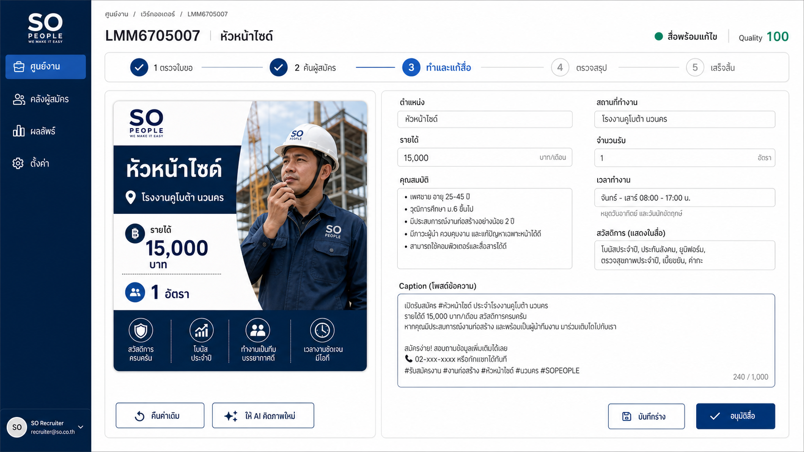

# แผนงานหลักของ Project: SO Recruitment Automation

> ไฟล์นี้เป็นแหล่งอ้างอิงแผนงานกลาง (Single Source of Truth) สำหรับคนและ AI ทุกโมเดล
>
> อัปเดตล่าสุด: 1 กันยายน 2026 (Asia/Bangkok)
> สถานะ: Operational Readiness snapshot = 77% ณ 31 สิงหาคม 2026 หลังทดสอบงานจริง; ระบบหลัก, Content Golden Flow, JobThai, Queue และ Facebook Preflight ผ่าน แต่ **Phase 9 ยังไม่ปิด** เพราะ JobBKK เปิด Resume Search Talent ไม่ได้และเกิด Error จริง 1 งาน รวมทั้ง Worker Facebook ยังเป็น `preflight` จนกว่าจะได้รับอนุญาตโพสต์จริง

## กติกาการใช้ไฟล์นี้

1. ทุกครั้งที่มีการวางแผนใหม่ ให้เพิ่มหรือปรับแผนในไฟล์นี้ก่อนส่งมอบ
2. หากขอบเขต ลำดับ หรือการตัดสินใจเปลี่ยน ให้แก้หัวข้อเดิม ไม่สร้างแผนซ้ำหลายไฟล์โดยไม่จำเป็น
3. ทุกการอัปเดตต้องบันทึกในหัวข้อ “ประวัติการปรับแผน”
4. ห้ามทำเครื่องหมายว่างานเสร็จจากการคาดเดา ต้องมีผลทดสอบหรือหลักฐานรองรับ
5. ห้ามแก้ข้อมูลย้อนหลัง ลบ Error หรือเปลี่ยนสถานะงานเพื่อทำให้ Dashboard เป็นสีเขียว
6. โมเดลที่ลงมือทำต้องอัปเดตสถานะ เช็กบ็อกซ์ หลักฐาน และ Commit ที่เกี่ยวข้องกลับเข้ามาในไฟล์นี้

## คำจำกัดความสถานะ

| สถานะ | ความหมาย |
|---|---|
| ✅ เสร็จและพิสูจน์แล้ว | มีโค้ด ผลทดสอบ และผลใช้งานจริงตามเกณฑ์รับงาน |
| 🟡 มีแล้วแต่ยังไม่จบ | มีโค้ดหรือ UI แล้ว แต่ Golden Flow/ความเสถียร/คุณภาพยังไม่ผ่านครบ |
| ⬜ วางแผนแล้ว | มี Requirement และแนวทาง แต่ยังไม่มีผลลัพธ์ที่ตรวจรับได้ |
| ⏸ พักไว้ | ตั้งใจยังไม่ทำในรอบปัจจุบัน |

## Master Roadmap — รวม Phase เดิมทั้งหมด

> สถานะในตารางนี้ประเมินจากโค้ด, Git history และเอกสาร ณ วันที่อัปเดต ไม่ถือว่า “เสร็จ” เพียงเพราะมีหน้า Web หรือมี Commit

| Phase | เป้าหมาย | สถานะปัจจุบัน | งานที่เหลือก่อนตรวจรับ |
|---|---|---|---|
| 0. Foundation & Settings | รวม Connector, บัญชี Facebook, Job และตั้งค่าโพสต์ไว้ใต้ Settings | 🟡 มีแล้วแต่ยังไม่จบ | ตรวจทุกหน้าด้วยข้อมูลจริง, ตัดทางเก่าที่ซ้ำ, ยืนยัน Pin บัญชีกับ Worker |
| 1. ใบขอและศูนย์งาน | รับใบขอ, แปลงข้อมูล, ตรวจความครบถ้วน และเลือก Scraping/Content/ทั้งสอง | 🟡 มีแล้วแต่ยังไม่จบ | ทำใบขอเป็น Parent Work Order จริง, แสดง Next Action และสถานะลูกทุกงานให้ครบ |
| 2. Resume Sourcing | JobBKK/JobThai, คำค้นอัตโนมัติ, อายุ/วันที่อัปเดต, รูป, dedupe และค้นต่อจนถึงเป้า | 🟡 มีแล้วแต่ยังไม่จบ | JobThai สดผ่านแล้ว; เหลือแก้สิทธิ์/Session นายจ้าง JobBKK และพิสูจน์ Live Search |
| 3. Candidate Library & Qualification | คลังผู้สมัคร, รูปทุกคน, อ่านแล้ว/โทรแล้ว, Hard Filter และผลตรวจรับ | 🟡 มีแล้วแต่ยังไม่จบ | แสดงเหตุผลผ่าน/ไม่ผ่านรายคน, ตรวจรูป/ไฟล์ครบ, เพิ่มคะแนนความเหมาะสมต่อใบงาน |
| 4. Content Intelligence | ใช้ข้อเท็จจริงใบขอ, Google Trends, คำค้นแนะนำ, Facebook research และ Second Brain | 🟡 มีแล้วแต่ยังไม่จบ | พิสูจน์ Research Gate สด, ตรวจ provenance และห้ามข้อมูลเทรนด์เปลี่ยนข้อเท็จจริงใบขอ |
| 5. Image, Template & Editor | สร้างภาพตรงตำแหน่ง, แก้ข้อความ/Caption, คิดใหม่, Template, Logo และ Brand Rule | 🟡 มีแล้วแต่ยังไม่จบ | พิสูจน์ gpt-image-2 จริง, ตรวจ Editor บน Web, ทำระบบ Template/Material/Brand Lock จาก Artwork |
| 6. Approval & Facebook Autopost | ตรวจงาน, อนุมัติ, สรุปกลุ่ม, Preflight, โพสต์ และติดตามจนเสร็จ | 🟡 มีแล้วแต่ถูก Block | เปิด Worker รุ่นตรง Production, แก้ Failure streak, Controlled Real Post และป้องกันโพสต์ซ้ำ |
| 7. Results, Leads & Learning | เก็บผู้สนใจ, engagement, A/B, Winning/Losing Pattern, รายงานและเรียนรู้ | 🟡 มีแล้วแต่ยังไม่พิสูจน์ | ทดสอบผลจริง, แยก human feedback/measured result, ตรวจ Sample Size ก่อนเลื่อน Pattern |
| 8. Candidate Fit Score | ให้แต่ละใบงานกำหนด Hard Gate และน้ำหนัก แล้วสรุปผู้สมัครเหมาะกี่ % | ⬜ วางแผนแล้ว | ออกแบบข้อมูล, Scorecard Editor, Evidence, Re-score และ Threshold ตามหัวข้อด้านล่าง |
| 9. Production Readiness | Version Contract, Worker, Queue, Golden Flow, Monitoring และ E2E | 🟡 กำลังเป็นลำดับแรก | ทำ Release Gate A–G ให้ผ่านทั้งหมด |
| 10. Scale & Cloud Worker | ย้ายจากเครื่องชั่วคราวไป Worker 24/7/Cloud เมื่อระบบนิ่ง | ⏸ พักไว้ | เริ่มหลัง Phase 9 ผ่านและวัดเสถียรภาพบนเครื่องนี้แล้ว |

## ลำดับความสำคัญที่ตัดสินแล้ว

1. **Phase 9 — Production Readiness:** ทำระบบปัจจุบันให้รันเองและจบจริงก่อนเพิ่ม Feature
2. **Phase 8 — Candidate Fit Score:** ทำให้ผล Scraping ตอบโจทย์ธุรกิจว่าใครเหมาะกับใบงานกี่เปอร์เซ็นต์
3. **Phase 5 — Template/Brand System:** ทำหลัง Artwork ส่ง Template, Logo, Font, Size และ Placement Rule
4. **Phase 7 — Learning Optimization:** เปิดใช้เต็มเมื่อมีผลจริงเพียงพอ ไม่เรียนรู้จากตัวอย่างเดียว
5. **Phase 10 — Scale/Cloud:** ย้าย Worker หลัง Golden Flow บนเครื่องนี้เสถียรแล้ว

## รายละเอียด Phase 8 — Candidate Fit Score

### Workflow เป้าหมาย

```text
ใบขอเข้ามา
→ AI แปลงเป็น Candidate Spec
→ ระบุ Hard Gate และปัจจัยให้คะแนน
→ คนตรวจและปรับน้ำหนักรวมให้เท่ากับ 100%
→ ระบบ Scrape และเก็บหลักฐาน Resume
→ ตรวจ Hard Gate
→ คำนวณคะแนนตามใบงาน
→ แสดงคะแนน เหตุผล และข้อมูลที่ยังไม่ทราบ
```

### กติกาที่ห้ามผิด

- Hard Gate แยกจากน้ำหนัก เช่น ใบขับขี่หรือใบอนุญาตบังคับ ไม่ให้คะแนนอื่นมาชดเชย
- ข้อมูลที่ Resume ไม่ระบุต้องเป็น `needs_review`/Unknown ห้ามเดาว่าผ่าน
- ผู้สมัครคนเดียวกันมีคะแนนต่างกันได้ในแต่ละใบงาน
- เปลี่ยนน้ำหนักแล้ว Re-score ได้โดยไม่ต้อง Scrape ใหม่
- ทุกคะแนนต้องย้อนดูหลักฐานจาก Resume ได้

### ผลลัพธ์รายคน

- สถานะ: `qualified`, `needs_review` หรือ `rejected`
- คะแนนความเหมาะสมต่อใบงาน
- ความครบถ้วนของหลักฐาน
- ผล Hard Gate รายข้อ
- คะแนนย่อยและเหตุผล
- Source/Resume ที่ใช้เป็นหลักฐาน

### งานที่ต้องทำ

- [x] นิยาม Candidate Spec และ Scorecard Version (`candidate-fit-v1`: Role/Experience, Hard Gate, Soft Evidence, Evidence Confidence)
- [ ] ทำ Hard Gate Editor และ Weight Editor ต่อใบงาน
- [ ] กำหนดน้ำหนักเริ่มต้นตาม Job Family แต่ให้คนแก้ได้
- [x] ทำ Scoring Engine ที่อธิบายผลได้
- [x] ผูก Assessment กับใบงานและ Candidate โดยไม่แก้ข้อมูล Candidate ต้นฉบับ (`scrape_task_candidates`)
- [x] ทำหน้าสรุปเรียงผู้สมัครตามสถานะก่อนคะแนน
- [x] ทำ Re-score จาก Candidate Spec/Resume เดิมโดยไม่ Scrap และไม่ใช้โควตาเพิ่ม (Weight Editor ยังเป็นงานถัดไป)
- [x] เพิ่ม Test กรณีตก Hard Gate แต่ Soft Score สูง, หลักฐานหาย และผู้สมัครซ้ำ

### Phase 8.1 — ผู้สมัครแยกตามใบงานและจัดอันดับ (กำลังทำ)

เป้าหมายรอบนี้คือแก้ปัญหาคลังผู้สมัครรวมจนคนทำงานหา Resume ของแต่ละใบงานไม่เจอ โดยใช้ข้อมูลผูกงานและผล Qualification เดิมเป็น Source of Truth ไม่สร้างรายชื่อหรือคะแนนซ้ำอีกชุด

- [x] เพิ่มหน้า `ผู้สมัครตามใบงาน` เป็นกล่อง แสดงตำแหน่ง เลขใบขอ เป้าหมาย ผลผ่าน/ต้องตรวจ/ไม่ผ่าน และเวลาที่ได้ Resume ล่าสุด
- [x] กดกล่องแล้วเปิดรายชื่อเฉพาะผู้สมัครที่ Scrap จากใบงานนั้น
- [x] เรียง `qualified` ก่อน `needs_review` ก่อน `rejected` และเรียงคะแนนมากไปน้อยภายในสถานะ
- [x] แสดงคะแนนความเหมาะสม เหตุผล Hard Gate หลักฐานที่ผ่าน และข้อมูลที่ยังต้องตรวจเป็นภาษาคน
- [x] ผู้สมัครคนเดียวกันต้องมีคะแนนต่างกันได้ตามใบงาน โดยอ้างอิง `scrape_task_candidates`
- [x] ห้ามแสดง `100%` เมื่อไม่มีเกณฑ์หรือหลักฐานรองรับ และห้ามนับ `needs_review` เป็นผ่าน
- [ ] เพิ่ม Test Query/Scoring และทดสอบ Build + Web จริง — Unit 99/99, Production Build และ Read-only DB Query ผ่าน; เหลือเปิดตรวจ Visual หลัง Login ใหม่

หลักฐานรอบ 31 ส.ค. 2569:

- ฐานจริงพบ 9 งานที่มีผู้สมัครผูกกับใบงาน และ Query แยก qualified/needs_review/rejected ได้ครบ
- Re-score ผลเดิม 437 Candidate×Task ด้วย `candidate-fit-v1` แล้ว คะแนนถูกเก็บเฉพาะความสัมพันธ์ต่อใบงานและ Resume ต้นฉบับไม่ถูกแก้
- หลัง Re-score งานจริงมีความหลากหลายสูงสุด 6 ระดับคะแนน; กรณีหลักฐานเท่ากันคงคะแนนเท่ากันและใช้ความครบหลักฐาน/เวลาพบล่าสุดเป็น Tie-breaker
- `node --test tests/*.test.js` ผ่าน 99/99
- `web npm run build` ผ่าน และสร้าง Route `/candidates/jobs` กับ `/candidates/jobs/[taskId]`
- Browser ถูกพากลับหน้า Microsoft Login หลังรีสตาร์ต Production server จึงยังไม่ปิดเช็กบ็อกซ์ Visual Web จนกว่าจะ Login ใหม่

### Phase 8.2 — Resume ที่อัปเดตล่าสุดก่อน

เป้าหมายคือให้ Connector เปิด Resume ใหม่สุดก่อนจริง ไม่ใช้เวลาที่ระบบเขียนฐานข้อมูลแทนวันที่แก้ไขของแพลตฟอร์ม และห้ามเดินต่อหากยืนยันลำดับไม่ได้

- [x] JobThai ส่ง `sort=` ซึ่งหน้า Employer ระบุว่า `วันที่แก้ไขล่าสุด`
- [x] JobThai ตรวจตัวเลือกที่ถูกเลือกจาก HTML ก่อนเปิด Resume หากเว็บเปลี่ยนจนยืนยันไม่ได้ให้หยุดพร้อม Error
- [x] โหมดตั้งแต่วันที่ส่ง `time=65535` และ `theDate=YYYY-MM-DD` ตามฟิลด์จริงของ JobThai
- [x] JobBKK ตรวจตัวเลือก Sort ที่มีความหมายว่าอัปเดตล่าสุด หรือพิสูจน์ลำดับจากวันที่บน Card; หากไม่มีหลักฐานให้หยุดแทนการดึงผิดลำดับ
- [x] เพิ่ม Unit Test วันที่ไทย/พ.ศ., ลำดับใหม่ไปเก่า, JobThai query contract และ fail-closed contract
- [ ] JobBKK Live Search: Login ถึง Dashboard ได้ แต่ทั้ง `/resumes/premium` และ `/resume/lists` ถูก Redirect ออกจาก Employer Resume Search จึงยังทดสอบ Sort จริงไม่ได้ ต้องแก้สิทธิ์/Session ของบัญชีหรือยืนยัน URL ใหม่ก่อน

หลักฐานรอบ 31 ส.ค. 2569:

- ตรวจหน้า JobThai Employer จริงพบ `#mainsort` เลือก `วันที่แก้ไขล่าสุด`, Card เรียง 31 ส.ค. 69 → 30 ส.ค. 69 และฟิลด์วันที่คือ `#selecttime`, `time=65535`, `name=theDate`
- JobThai Live Search ด้วยวันที่เริ่ม `2026-08-20` ได้ 5/5 Resume จากหน้าแรกและผ่าน Latest Sort Gate
- Node Test ทั้งระบบผ่าน 110/110 และ `web npm run build` ผ่าน
- JobBKK ถูกบล็อกก่อน Search ที่ `src/providers/jobbkk/browser/jobbkk-filters.js` เพราะ Premium UI ไม่พร้อม; ห้ามรายงานว่าทดสอบ JobBKK Latest Sort ผ่าน

## เป้าหมายปัจจุบัน

ทำให้ Production Readiness เป็น 100% จากการพิสูจน์ Golden Flow จริง:

```text
รับใบงาน
→ Web ส่งงานเข้าคิว
→ Worker รับงานเอง
→ สร้าง Caption และภาพที่ผ่าน Quality Gate
→ ตรวจ Facebook แบบไม่โพสต์จริง
→ เผยแพร่จริงในกลุ่มทดสอบที่อนุญาต
→ ติดตามผลและปิดงาน
```

สำหรับ Scraping ต้องพิสูจน์เส้นทาง:

```text
รับรายละเอียดงานและจำนวนเป้าหมาย
→ Web ส่งงานเข้าคิว
→ Worker ค้นจาก Connector
→ ตัดคนซ้ำและตรวจ Hard Filter
→ ส่งมอบ Resume หรือรายงานว่าตลาดไม่พอพร้อมหลักฐาน
```

## สถานะที่ตรวจพบล่าสุด

| ด่าน | สถานะ | หลักฐาน/ความหมาย |
|---|---|---|
| เครื่องสร้างประกาศ | ผ่าน | `SONB-RM009` ออนไลน์ และรายงาน `draft` + `content_pipeline=evidence-v1` |
| สิทธิ์สร้างรูป AI | ผ่านที่ Worker | Worker รายงาน `gpt-image-2` และ `configured=true` โดยไม่เปิดเผย Key |
| เครื่องเผยแพร่ Facebook | รออนุญาตโพสต์จริง | `SONB-RM009` ออนไลน์แบบ `preflight` เท่านั้นและปิด `AUTO_POST_DAILY_ENABLED=0`; จะเปิด `post` ต่อเมื่อผู้ใช้ยืนยันเป้าหมายและอนุญาต ณ เวลาทำจริง |
| Facebook Preflight | ผ่าน | งาน `pf_mtgzcbni_readiness` จบ `completed` แบบไม่โพสต์จริงเมื่อ 31 ส.ค. 2026; Session และกลุ่มผ่าน |
| บัญชีและกลุ่ม Facebook | ผ่าน | 1 บัญชีถูก Pin มาที่ `SONB-RM009` และมี 1 กลุ่ม |
| Caption และภาพ | ผ่านที่ Golden Flow | ใบงาน `LMM6705007` สร้างร่างใหม่ `23c164ea-b2e3-4a09-8d84-80951eea41ae` ผ่าน Quality 100, Research Gate และภาพจริงจาก `gpt-image-2` |
| Scraping | ระบบผ่าน/ผลตลาดแยก | ครบเป้า 1 งาน, ตลาดไม่พอ 7 งาน, ระบบขัดข้อง 0 งาน; JobThai สดได้ 5/5 แต่ JobBKK ยังติด Employer Session |
| คิวเบื้องหลัง | ผ่าน | Self-test `6c783df7-7b7b-4272-8556-52794c272794` ถูก Worker claim และจบ `done`; ไม่มีงานค้าง |
| Facebook ล่าสุด | ผ่านแบบไม่โพสต์จริง | ไม่มี post queue ค้างหรือ failed ใน 24 ชม.; Controlled Real Post ยังไม่เริ่ม |
| Unit/Build/Logic Test | ผ่าน | Node test 112/112, AutoPost logic 4/4 และ `web npm run build` ผ่าน เมื่อ 31 สิงหาคม 2026 |

## Root Cause ที่ยืนยันจากโค้ด

### RC-01: Worker ไม่ได้รันบนเครื่องนี้

- ตอนตรวจไม่พบ Process `node` และไม่พบ Port ของระบบที่กำลัง Listen
- ผลกระทบ: งานสร้างประกาศ, Scraping และ Facebook ไม่มีเครื่องรับงาน
- จุดเริ่ม Worker: `start-workers.bat`

### RC-02: Version Contract ระหว่าง Production กับ Worker ไม่ตรงกับโค้ดปัจจุบัน

- เดิม Production fallback ยอมรับ Worker SHA: `a602d66cd932c23de05541cae70bd3456a76f56e`
- Commit ปัจจุบันของ Repository: `daa49f9d6c8ae7be99f33baebbf9c09d77b9c34e`
- จุดกำหนดค่า:
  - `web/lib/repo.ts`
  - `autopost/server/index.js`
- ผลกระทบ: Worker ใหม่อาจออนไลน์แต่ถูกกรองออกหรือได้รับ `upgrade_required`

### RC-03: ไม่มี Content Golden Flow รุ่นใหม่ที่ผ่านหลักฐานครบ

- Readiness ต้องพบ `quality_status='pass'`
- ต้องมี `image_bytes`
- ต้องมี `gen_notes.image_generation.ok=true`
- ผลกระทบ: ระบบยังยืนยันไม่ได้ว่า Caption และภาพพร้อมใช้จริง

### RC-04: Facebook มี Failure Streak จริง

- การผ่าน Preflight ไม่สามารถล้างผลล้มเหลวจากการเผยแพร่จริงได้
- ผลกระทบ: ห้ามรายงานว่า Production พร้อมจนกว่าจะมี Controlled Real Post สำเร็จและไม่มี Error ใหม่ในช่วงเฝ้าระวัง

### RC-05: Readiness ผสม “ตลาดมีคนไม่พอ” กับ “ระบบไม่พร้อม”

- งาน Scraping แบบ `partial` อาจเกิดจากตลาดไม่พอ แม้ระบบทำงานครบและไม่มี Error
- ปัจจุบัน `src/core/workflow-readiness.js` ลดสถานะเป็น Warning เมื่อมีงาน Partial
- ผลกระทบ: คะแนน Production Readiness ไม่สะท้อนความพร้อมของระบบอย่างตรงไปตรงมา

### RC-06: Dashboard เดิมนับแค่ Capability แต่ยังไม่ยืนยันผล Facebook จริง

- เดิม `src/core/workflow-readiness.js` นับ Facebook Preflight ว่าผ่านเพียงเพราะ Worker ประกาศ capability `preflight` และนับ Facebook Worker ว่าพร้อมโพสต์เพียงเพราะ `kind='autopost'`
- ผลกระทบ: Worker แบบ preflight-only หรือบัญชีที่ Login ไม่สำเร็จอาจทำให้ Dashboard เขียวเกินจริง
- แก้ใน Commit `26c6940941642b7e836482328b38979538b9618a`: ต้องมี capability `post` จึงนับว่าเผยแพร่จริงได้ และต้องมี Preflight สำเร็จของบัญชีภายใน 24 ชั่วโมงจึงนับว่า Facebook Preflight ผ่าน

### RC-07: Facebook Session ของบัญชีที่ผูกไว้เคยเข้าใช้งานไม่ได้ — แก้แล้ว

- ก่อนแก้ งาน Preflight แบบไม่โพสต์จริงถูก Worker `SONB-RM009` claim แล้ว แต่จบ `failed`; Playwright Trace หลังส่ง Login พบ Facebook ทำงานในสถานะผู้ใช้ `__user=0`
- เจ้าของบัญชียืนยัน Facebook checkpoint บนเครื่อง Worker แล้ว งาน `pf_mt89o4hc` จบ `completed` ใน mode `preflight` เมื่อ 25 ส.ค. 2026
- จุดที่ตรวจและหยุดอย่างปลอดภัย: `autopost/src/helpers/facebookLogin.ts:107-155` และ `autopost/tests/facebookPreflight.spec.ts:4-29`
- ไม่ได้มีการโพสต์จริง, ไม่ได้เปลี่ยนสถานะ Error และไม่พยายามข้าม checkpoint/ความปลอดภัยของ Facebook

### RC-08: Research Gate หยุดหลังตรวจ Facebook เพียงชุดแรก

- เดิม `collectFacebookPosts` จำกัดการตรวจไว้ 4 กลุ่มต่อรอบ จึงสรุปว่าไม่มีโพสต์ที่เกี่ยวข้องทั้งที่ยังสำรวจ source ที่กำหนดไม่ครบ
- ผลกระทบ: Golden Flow หยุดเป็น `needs_input` ทั้งที่ Google Trends ใช้งานได้และ Facebook session ถูกต้อง
- แก้: `src/core/market-research.js` ตรวจได้สูงสุด 50 กลุ่ม (bounded) และส่งสัญญาณ coverage ครบ; หาก Google มีหลักฐานและตรวจทุกกลุ่มที่ตั้งค่าแล้วไม่พบโพสต์ตรงตำแหน่ง ให้ผ่านเป็น **market gap** โดยไม่สร้าง Engagement ปลอม

### RC-09: รหัสเพศเปิดกว้างจาก ERP ถูกโมเดลแปลงเป็นชาย/หญิง

- ใบขอ `LMM6705007` มี `gender=O` ซึ่งหมายถึงไม่ระบุเพศ แต่ร่างแรกระบุเพศชายใน Caption และเพศหญิงบนโปสเตอร์ โดย Quality Gate เดิมไม่ตรวจ
- แก้: normalize `O/all/any/ไม่จำกัดเพศ` เป็นค่าว่างก่อนส่งเข้า Caption/Poster และเพิ่ม Quality Gate บล็อกเมื่อสื่อระบุชาย/หญิงที่ใบขอไม่ได้กำหนด
- ผลพิสูจน์: ร่างใหม่ `2f7c0dab-2ecd-4ba3-925a-75dd86a2358c` ไม่มีการอ้างเพศ และ Quality check `gender=pass`

### RC-10: Readiness ตีงานค้นหาที่ยังทำงานเป็นงานค้าง และ lock จาก Worker ที่หยุดรอนานเกินไป

- งาน `ธุรการ` ถูก process `SONB-RM009#24376` รับแล้ว process หยุดระหว่างรีเฟรช Worker; Queue lock เดิมรอ recovery 30 นาที ขณะที่ Dashboard แจ้งเตือนหลัง 10 นาที
- เกณฑ์เดิมใน `web/lib/repo.ts` ใช้เวลา Resume ล่าสุด จึง Fail แม้ `scrape_runs.heartbeat_at` ของงานใหม่ยังเดินอยู่หรือกรณีตลาดไม่มี Resume ตรงเงื่อนไข
- แก้: Readiness ตรวจ heartbeat ของ active `scrape_run` โดยตรง; Fail เฉพาะ run ที่หยุดรายงานเกิน 10 นาที ไม่เอา market gap มาปนกับ system failure
- ผลตรวจจริง: คืนเฉพาะ lock ที่ยืนยันว่า process เดิมหายแล้วกลับ Queue, Worker รับใหม่และงานปิด `partial` อย่างถูกต้อง (ผ่าน 5/15, ต้องตรวจเพิ่ม 1, ไม่ผ่าน 85); เกณฑ์ใหม่พบ stalled execution 0 งาน

### RC-11: Failure จากการทดสอบเคยค้างใน Dashboard โดยไม่มีบทเรียนถาวร

- ตรวจ Failure Facebook 7 รายการ: 1 รายการเป็น Phase 9 Preflight ที่ไม่โพสต์จริง และ 6 รายการเป็น Auto Daily จาก Mac เก่าที่ไม่มี Build Contract; Assignment เดิมไม่มี Post Log จึงยืนยันว่าไม่มีการเผยแพร่จริง
- ก่อนลบ บันทึกลง `operational_failure_lessons` 2 บทเรียน: Session ต้องผ่าน Preflight และ Auto Daily ต้องใช้ Worker ที่ Pin/มี Build Contract; เก็บเฉพาะหมวดสาเหตุและวิธีป้องกัน ไม่มี credential หรือข้อมูลผู้สมัคร
- ลบเฉพาะ `post_run_queue` 7 แถวและ `run_logs` ทดสอบ 1 แถวหลังตรวจหลักฐานแล้ว; ไม่ลบ Assignment, Job, Candidate หรือผลโพสต์จริง
- เพิ่ม Skill ไทย `.agents/skills/autopost-failure-learning` และให้ `completePostRunJob` บันทึก Failure ใหม่อัตโนมัติก่อนจบงาน
- บังคับที่ Server: Worker จะ claim งาน `post` ไม่ได้จนกว่าบัญชีเดียวกันจะมี `preflight=completed` ภายใน 24 ชั่วโมง

### RC-12: กฎล้างเพศบนโปสเตอร์ใช้ Word Boundary ที่ไม่รองรับภาษาไทย

- `applyTrustedPosterFacts` เดิมใช้ `\b` ต่อท้ายคำไทย จึงไม่จับข้อความที่ AI แต่งว่า `เพศชาย`/`เพศหญิง` แม้ใบขอ `gender=O`
- แก้ `src/core/campaign-facts.js` ให้ใช้ขอบเขตช่องว่าง/เครื่องหมายที่รองรับภาษาไทย และเพิ่ม Regression Test
- ผลพิสูจน์: Golden Flow รอบใหม่ใช้ Queue `6f3e6da5-d063-4b46-baad-6336dd749dad`, ได้ Content `23c164ea-b2e3-4a09-8d84-80951eea41ae`, Quality 100, `image_generation.ok=true`, model `gpt-image-2` และไม่มีข้อเท็จจริงเรื่องเพศเกินใบขอ

### RC-13: Scraper Pool สร้าง Restart Timer ซ้ำและลบ Lock โดยไม่ผูกกับ PID

- เมื่อ runner จบ Pool เดิมอาจตั้ง timer เปิด slot เดิมมากกว่าหนึ่งครั้ง ทำให้เกิดข้อความ `work-queue runner already active` และ Worker ดูเหมือนไม่เสถียร
- แก้ `workers/scraper-pool.mjs` ให้หนึ่ง slot มี restart timer ได้หนึ่งตัว, ตรวจ child ที่กำลังทำงานก่อนเปิด และลบเฉพาะ lock ที่บันทึก PID ตรงกับ child ที่เพิ่งจบ
- ทดสอบ kill slot จริงแล้ว Pool เปิดใหม่หนึ่งครั้งภายใน 3 วินาที โดยไม่เกิด restart loop

### RC-14: JobBKK รายงาน Login ผ่านผิดเมื่อถูกส่งกลับหน้า `/home`

- Logic เดิมถือว่า URL ใด ๆ ที่ไม่ใช่หน้า Login/`noLogIn` คือสำเร็จ จึงนับหน้า Jobseeker `/home` เป็น Employer Session
- แก้ `src/providers/jobbkk/session.js` ให้ผ่านเฉพาะ URL ใต้ `/employer/` และเพิ่ม Test URL Contract
- Live Diagnostic ยืนยันว่าบัญชีปัจจุบันถูกส่งกลับ `/home`; ระบบจึงหยุดพร้อมข้อความภาษาคนแทนการค้นต่อผิดหน้า ส่วนการปลดล็อกต้องตรวจสิทธิ์บัญชีนายจ้าง/แพ็กเกจ Resume กับ JobBKK

### RC-15: Web Pin ด้วยชื่อเครื่อง แต่ Scraper Pool ประกาศชื่อเป็นราย Slot

- Task ล่าสุด `77fe1117-b7ee-45a9-aaa3-e8a0725456ab` ถูกสร้างแล้วแต่ไม่เข้า `work_queue`; DB ยืนยัน `last_error=เครื่อง SONB-RM009 ที่ตั้งไว้ยังไม่พร้อมรับงาน`
- Root Cause คือ `SCRAPE_PREFERRED_WORKER=SONB-RM009` แต่ Worker ออนไลน์จริงประกาศชื่อ `scraper-1`/`scraper-2`; Logic เดิมเปรียบเทียบชื่อสองชนิดนี้ตรง ๆ
- แก้ให้ heartbeat รายงาน `machine_name` และให้ Web เลือก slot ที่ออนไลน์จากชื่อเครื่องหรือชื่อ slot ได้ พร้อม Regression Test 3 กรณี; ชุด Test รวมผ่าน 115/115 และ Production Build ผ่าน
- ผลทดสอบสด: Task เดิมเข้า Queue `e2a0d67d-f8a2-445c-ac75-140ea789cd5a` และ Worker `scraper-1#13720` claim ภายในประมาณ 1 วินาที จึงปิดปัญหา “กดแล้วไม่มีงานเข้า Queue”; จากนั้น JobBKK ล้มที่ `Resume Search Talent premium page not ready` ครบ Retry และจบ `error` โดยไม่ค้าง แยกเป็น Blocker สิทธิ์/แพ็กเกจของแพลตฟอร์ม

## Recommendation หากเลือกเพียงทางเดียว

ทำ Golden Flow Release บน Worker เครื่องนี้ให้ครบหนึ่งรอบ แล้วแยก Operational Readiness ออกจาก Business Outcome ของตลาดผู้สมัคร

## แผน UX กลาง — ใบงานเดียว ทำงานต่อเนื่อง ไม่ต้องเดาหน้า

> แผนนี้รวมงานของ Phase 1, 2, 5 และ 6 ให้เป็นประสบการณ์เดียว โดยยังไม่เปลี่ยนลำดับความสำคัญ: ต้องปิด Phase 9 ให้ผ่านก่อนเริ่มแก้ UI ชุดใหญ่

### หลักการตัดสินใจ

- ใช้ `/orchestrator` เป็น **ศูนย์งานเดียว** สำหรับใบขอ Scraping, Content หรือทำทั้งสองอย่าง
- ใบขอหนึ่งใบเป็น Parent Work Order และมีงานลูก `scraping` / `content` ตามสิ่งที่ใบขอสั่ง
- คนไม่ต้องคัดลอกข้อมูลจากใบขอไปกรอกใหม่: AI แปลงข้อมูลลงช่องให้ก่อน คนมีหน้าที่ตรวจ แก้ และอนุมัติ
- หน้ารายละเอียดใบงานเป็นหน้าเดียวตลอดงาน ใช้ Stepper บอกว่าอยู่ขั้นไหน สิ่งที่ระบบทำแล้ว และสิ่งที่คนต้องทำต่อ
- แต่ละสถานะมีปุ่มหลักเพียงหนึ่งปุ่ม เช่น `อนุมัติและเริ่มค้นหา`, `อนุมัติให้สร้างสื่อ`, `อนุมัติสื่อ`, `เริ่ม Auto-post`
- ซ่อนคำระบบ เช่น queue, worker, capability และ heartbeat จากผู้ใช้ทั่วไป; แสดงเป็นภาษาคน เช่น `กำลังรอเครื่อง`, `กำลังค้นหา`, `ต้องเข้าสู่ระบบใหม่`
- หน้า `/scraping` แบบกรอกเองยังเก็บไว้เป็น `สร้างงานค้นหาเอง` สำหรับกรณีไม่มีใบขอ แต่ไม่ใช่เส้นทางหลัก

### เส้นทางรวม

```text
ใบขอเข้ามา
→ AI อ่านและแปลงใบขอ
→ คนตรวจข้อมูลกลางและเลือก/ยืนยันสิ่งที่ต้องทำ
→ อนุมัติ
   ├─ Scraping: สร้าง Search Spec → เริ่มค้นหา → ดูความคืบหน้า → ตรวจผล
   └─ Content: สร้าง Research + Caption + ภาพ → แก้ภาพและ Caption หน้าเดียว → อนุมัติสื่อ
→ หน้าสรุปผลของใบงาน
→ ถ้ามี Content: เลือกบัญชี/กลุ่มและขออนุมัติ Auto-post
→ เสร็จสิ้นและเก็บผลเรียนรู้
```

### หน้าที่ 1 — ศูนย์งาน

การ์ดใบงานต้องแสดงเฉพาะข้อมูลที่ช่วยตัดสินใจ:

- เลขใบขอ, ตำแหน่ง, พื้นที่, จำนวน และผู้ขอ
- ประเภทงาน: `หาผู้สมัคร`, `ทำสื่อ` หรือ `ทำทั้งสองอย่าง`
- สถานะภาษาคน: `รอตรวจใบขอ`, `กำลังทำ`, `รอตรวจผล`, `เสร็จแล้ว`, `ต้องช่วยแก้`
- ความคืบหน้างานลูก เช่น `Scraping 8/15` และ `Content รอตรวจ`
- ข้อความ Next Action หนึ่งบรรทัดและปุ่ม `เปิดใบงาน`

### หน้าที่ 2 — ตรวจและแปลงใบขอ

ส่วนข้อมูลกลางที่ทั้ง Scraping และ Content ใช้ร่วมกัน:

- ตำแหน่ง, Job Family, เนื้องาน, สถานที่, จำนวน, รายได้, เวลางาน, อายุ, คุณสมบัติบังคับ, ข้อมูลติดต่อ
- ช่องที่ AI แปลงได้ต้องมีแหล่งอ้างอิงจากใบขอ; ช่องไม่ชัดแสดง `ต้องตรวจ` ห้ามเดา
- คนแก้ในหน้านี้ครั้งเดียว ข้อมูลที่ยืนยันแล้วเป็น Fact Snapshot สำหรับงานลูกทั้งสอง
- แสดงแผนงานที่จะเกิดหลังอนุมัติ เช่น `ค้นหา 15 Resume จาก JobThai + JobBKK` และ `สร้างภาพ+Caption 1 ชุด`

### เส้นทาง Scraping

1. AI แปลง Fact Snapshot เป็น Search Spec: ตำแหน่ง/คำพ้อง, พื้นที่, อายุ, Hard Filter, Soft Score, จำนวนเป้าหมาย และ Connector
2. คนตรวจและแก้ Search Spec ในหน้าใบงาน แล้วกด `อนุมัติและเริ่มค้นหา`
3. หน้าเดิมเปลี่ยนเป็น Live Progress: กำลังทำขั้นไหน, ค้นแพลตฟอร์มใด, ผ่าน/ต้องตรวจ/ไม่ผ่านกี่คน และระบบจะทำอะไรต่อ
4. เมื่อจบ แสดงผลเป็น `ครบเป้า`, `ตลาดมีไม่พอ` หรือ `ระบบมีปัญหา` แยกกันชัดเจน
5. คนเปิดรายชื่อผู้สมัคร ตรวจหลักฐาน และอนุมัติผลได้จากหน้าใบงาน โดยมีลิงก์ไปคลังผู้สมัครเมื่ออยากดูข้อมูลเต็ม

### เส้นทาง Content และ Editor หน้าเดียว

1. AI ใช้ Fact Snapshot + Research Gate สร้าง Caption, ภาพ และข้อมูลบนโปสเตอร์
2. หน้าใบงานแสดง Preview ภาพฝั่งซ้าย และ Editor ฝั่งขวาในหน้าเดียว
3. Editor ต้องแก้ได้ทันที: โลโก้, ตำแหน่ง, รายได้, จำนวนรับ, สถานที่, คุณสมบัติ, เวลางาน, CTA และ Caption เต็ม
4. แก้ข้อความแล้ว Preview เปลี่ยนทันที; มี `คืนค่าเดิม`, `บันทึกร่าง`, `ให้ AI คิดภาพใหม่` และ Version History
5. ภาพที่ AI สร้างเป็น Background/Subject Layer; ข้อความและโลโก้เป็น Layer ที่แก้ได้ ไม่ฝังรวมจนแก้ไม่ได้
6. ปุ่ม `อนุมัติสื่อ` อยู่ในหน้า Editor เดียวกัน หลังผ่าน Fact/Research/Quality Gate เท่านั้น
7. หลังอนุมัติไปส่วนสรุปในใบงานเดิม: แสดงภาพ, Caption เต็ม, บัญชี, รายชื่อ/จำนวนกลุ่ม และ Post Mode ก่อนกด `เริ่ม Auto-post`

### UI Target Contract — ต้องทำออกมาตามภาพนี้



ไฟล์อ้างอิงหลัก: `docs/ui-targets/unified-content-workspace-target.png`

ภาพนี้เป็น **สัญญาหน้าตาและโครงสร้างงาน** ไม่ใช่เพียงภาพประกอบ โมเดลที่ลงมือทำต้องรักษา Layout, Information Hierarchy, ตำแหน่งปุ่ม และพฤติกรรมตามรายการด้านล่าง หากจำเป็นต้องเปลี่ยนต้องอัปเดตภาพเป้าหมายและขอผู้ใช้อนุมัติก่อน

#### โครงหน้าที่ต้องตรงกับภาพ

1. ใช้ Shell เดียวของระบบ:
   - Sidebar สีน้ำเงินเข้มอยู่ซ้าย
   - Logo `SO PEOPLE` ด้านบน
   - เมนู `ศูนย์งาน`, `คลังผู้สมัคร`, `ผลลัพธ์`, `ตั้งค่า`
   - ข้อมูลผู้ใช้อยู่ด้านล่าง Sidebar
2. Header ของใบงานอยู่บนสุดของพื้นที่หลัก:
   - Breadcrumb `ศูนย์งาน / เวิร์กออเดอร์ / [เลขใบขอ]`
   - เลขใบขอและชื่อตำแหน่งแสดงเด่น
   - มุมขวาแสดงสถานะภาษาคน `สื่อพร้อมแก้ไข` และคะแนน `Quality 100`
3. Stepper แนวนอนอยู่ใต้ Header และใช้ชื่อคงที่:
   - `1 ตรวจใบขอ`
   - `2 ค้นผู้สมัคร`
   - `3 ทำและแก้สื่อ`
   - `4 ตรวจสรุป`
   - `5 เสร็จสิ้น`
4. Step ปัจจุบันใช้สีน้ำเงินและเห็นชัด ขั้นที่จบแล้วมีเครื่องหมายถูก ขั้นที่ยังไม่ถึงเป็นสีเทา
5. พื้นที่ทำงาน Step 3 แบ่งสองฝั่งในหน้าจอเดียว:
   - ฝั่งซ้ายประมาณ 45% เป็น Preview ภาพประกาศ
   - ฝั่งขวาประมาณ 55% เป็น Form แก้ข้อความและ Caption
   - ห้ามแยก Preview กับ Editor เป็นคนละหน้า/Modal/Tab

#### ฝั่งซ้าย — Preview ภาพ

- แสดงภาพประกาศสี่เหลี่ยมจัตุรัสเต็มพื้นที่และอ่านได้โดยไม่ต้องกดเปิดภาพ
- ภาพประกาศต้องประกอบจาก Layer ที่แก้ได้: Logo, Background/Subject, ตำแหน่ง, สถานที่, รายได้, จำนวนรับ, Highlight/Footer
- รูปบุคคลและสภาพแวดล้อมต้องตรงตำแหน่งจากใบขอ ไม่ใช่ภาพ Generic
- ปุ่มใต้ภาพเรียงตามภาพตัวอย่าง:
  - ซ้าย: `คืนค่าเดิม`
  - ขวา: `ให้ AI คิดภาพใหม่`
- การกด `ให้ AI คิดภาพใหม่` เปลี่ยนเฉพาะ Background/Subject และรักษาข้อเท็จจริงกับ Layer ข้อความเดิม
- การกด `คืนค่าเดิม` ต้องย้อนกลับไป Version ที่บันทึกล่าสุดได้จริง

#### ฝั่งขวา — Editor และ Caption

- Form ด้านบนเป็นสองคอลัมน์ตามภาพ:
  - แถว 1: `ตำแหน่ง` | `สถานที่ทำงาน`
  - แถว 2: `รายได้` | `จำนวนรับ`
  - แถว 3: `คุณสมบัติ` | `เวลาทำงาน`
  - แถว 4: `สวัสดิการ (แสดงในสื่อ)` ตามพื้นที่ที่เหมาะสม
- ช่อง `คุณสมบัติ`, `เวลาทำงาน` และ `สวัสดิการ` รองรับหลายบรรทัด
- ด้านล่าง Form เป็น `Caption (โพสต์ข้อความ)` แบบ Textarea ขนาดใหญ่ เห็น Caption ทั้งหมดและแก้ได้โดยไม่เปิด Modal
- ทุกการแก้ช่องที่ผูกกับภาพต้องอัปเดต Preview ฝั่งซ้ายทันที
- แสดงจำนวนตัวอักษร Caption และเตือนก่อนเกินข้อจำกัดแพลตฟอร์ม
- ปุ่มมุมล่างขวาเรียงตามภาพ:
  - Secondary: `บันทึกร่าง`
  - Primary: `อนุมัติสื่อ`
- `อนุมัติสื่อ` กดได้เมื่อ Fact Gate, Research Gate, Image Gate และ Quality Gate ผ่านเท่านั้น

#### สิ่งที่ภาพตัวอย่างไม่ได้อนุญาตให้ระบบแต่งเพิ่ม

- ข้อความตำแหน่ง, คุณสมบัติ, เวลางาน, สวัสดิการ, เบอร์โทร และตัวเลขในภาพเป็นตัวอย่าง Layout เท่านั้น
- ตอนใช้งานจริงทุกช่องต้องมาจาก Fact Snapshot ของใบขอหรือข้อมูลที่คนยืนยันล่าสุด
- ข้อมูลที่ใบขอไม่ระบุต้องว่างและขึ้น `ต้องตรวจ` ห้ามนำข้อความตัวอย่างในภาพไปใช้เป็น Default จริง
- คะแนน `Quality 100` ในภาพเป็นตัวอย่างสถานะ ต้องคำนวณจาก Quality Gate จริง

#### Responsive Contract

- Desktop ตั้งแต่ 1280px: ต้องคงสองฝั่งตามภาพและ Preview ต้องไม่เล็กจนอ่านข้อความไม่ได้
- Tablet 768–1279px: คง Stepper และวาง Preview เหนือ Editor หากสองคอลัมน์อ่านไม่สะดวก
- Mobile ต่ำกว่า 768px: Header และ Stepper ย่อได้ แต่ลำดับต้องเป็น Preview → ช่องแก้ → Caption → ปุ่มบันทึก/อนุมัติ
- ห้ามใช้ Horizontal Scroll กับ Form หลัก
- Primary Action ต้องมองเห็นโดยไม่ทับ Caption หรือปุ่มอื่น

#### Visual Regression Gate

- [ ] สร้าง Screenshot จริงจาก `/orchestrator/[id]` ที่ Desktop 1440×900
- [ ] เปรียบเทียบกับภาพเป้าหมาย: Shell, Stepper, สัดส่วนสองฝั่ง, ลำดับช่อง และตำแหน่งปุ่มต้องตรง
- [ ] สร้าง Screenshot ที่ 1024px และ 390px เพื่อยืนยัน Responsive Contract
- [ ] ตรวจ Light Theme, ภาษาไทย, Focus State, Error State และ Loading State
- [ ] ผู้ใช้ตรวจรับภาพ Desktop ก่อนเชื่อมปุ่มกับการโพสต์จริง
- [ ] ห้ามปิดงานด้วยคำว่า “ใกล้เคียง” หาก Preview และ Editor ยังแยกหน้า หรือองค์ประกอบหลักไม่ตรงภาพ

### สถานะที่ผู้ใช้ต้องเห็น

| สถานะระบบ | ข้อความภาษาคน | ปุ่มหลัก |
|---|---|---|
| `pending_intake_review` | รอตรวจข้อมูลจากใบขอ | ตรวจใบขอ |
| `ready_to_start` | ข้อมูลครบ พร้อมเริ่มงาน | อนุมัติและเริ่มงาน |
| `scraping` / `drafting` | ระบบกำลังทำงาน | ไม่มีปุ่มซ้ำ; แสดงความคืบหน้า |
| `needs_input` | ต้องการข้อมูลหรือให้คนช่วยหนึ่งเรื่อง | แก้ข้อมูล |
| `pending_result_review` | ระบบทำเสร็จ รอคุณตรวจผล | ตรวจผล |
| `content_editing` | สื่อพร้อมแก้ไข | บันทึกร่าง / อนุมัติสื่อ |
| `ready_to_post` | ตรวจสื่อแล้ว รอยืนยันปลายทาง | ตรวจสรุปและเริ่ม Auto-post |
| `posting` | กำลังเผยแพร่ X/Y กลุ่ม | ดูความคืบหน้า |
| `completed` | งานเสร็จแล้ว | ดูผลลัพธ์ |

### กติกาป้องกันความงงและบัค

- ห้ามมีปุ่ม `เริ่ม` มากกว่าหนึ่งปุ่มสำหรับงานเดียวในหลายหน้า
- การ Refresh ต้องกลับมาเห็นขั้นเดิมจากฐานข้อมูล ไม่ใช้ state ใน Browser เป็นแหล่งจริง
- ปุ่มสั่งงานต้อง idempotent: กดซ้ำหรือ Network retry แล้วไม่สร้าง Task, Draft หรือ Post ซ้ำ
- งาน Scraping และ Content สามารถทำคู่ขนาน แต่ Parent Work Order ปิดได้เมื่อทุกงานลูกถึงสถานะปลายทางที่ถูกต้อง
- `ตลาดมีคนไม่พอ` เป็นผลลัพธ์ทางธุรกิจ ไม่ใช่บัค; `Login/Queue/Worker ล้ม` เป็นปัญหาระบบและต้องบอกวิธีแก้
- การเผยแพร่จริงช่วง POC ต้องให้คนยืนยันบัญชีและกลุ่มทุกครั้ง
- ทุกหน้าต้องแสดง `ระบบกำลังทำอะไร`, `ได้อะไรแล้ว`, `ติดอะไร`, `คุณต้องทำอะไรต่อ`

### แผนแก้จากการรัน DEMO Content 4 ตำแหน่ง — ห้ามปิดจน UI ตรงภาพเป้าหมาย

หลักฐานจากการรัน `พนักงานขับรถ`, `ประชาสัมพันธ์`, `ช่างอาคาร` และ `คนสวน` วันที่ 25 ส.ค. 2026 พบว่าระบบเบื้องหลังกับหน้าจอยังสื่อสารสถานะไม่ตรงกัน: งานพนักงานขับรถหยุดที่ Research Gate แต่ Queue รายงาน `done`, ส่วนหน้าใบงานไม่แสดงเหตุผลและปุ่มแก้ไขที่ผู้ใช้ต้องทำต่อ นอกจากนี้หน้า Content Workspace ที่ใช้งานจริงยังไม่ตรง `docs/ui-targets/unified-content-workspace-target.png`

#### A. แก้สถานะและการทำงานเบื้องหลัง

- [x] เพิ่มแหล่งสำรองของ Google Research เมื่อ Suggestion ไม่คืนคำค้น โดยยังต้องเก็บหลักฐานจริงและห้ามลด Research Gate เพื่อให้ผ่านหลอก ๆ
- [x] เมื่อ Draft จบด้วย `needs_input` ให้ Queue จบด้วยสถานะที่สื่อว่า `ต้องให้คนช่วย` ห้ามรายงาน `done`
- [x] แยก `กำลังทำตามปกติ`, `รอคิว`, `ต้องให้คนช่วย` และ `ระบบขัดข้อง` ให้ชัดเจนจาก DB เดียวกัน
- [x] ป้องกัน Worker หลาย Process ใช้ชื่อเดียวกันแล้วทับ Heartbeat จนวินิจฉัยงานค้างผิดตัว
- [ ] เพิ่ม Timeout/Heartbeat รายขั้นสำหรับ Research, Caption และ Image พร้อม Retry ที่ปลอดภัยและไม่สร้างร่างซ้ำ

#### B. แก้ UI ให้ผู้ใช้ไม่ต้องเดา

- [x] แสดง `status_note` ทุกครั้งที่งานหยุดหรือรอ พร้อมข้อความภาษาไทยที่บอกสาเหตุจริง
- [x] ทุกสถานะต้องมี Action Center สี่บรรทัด: `ระบบกำลังทำอะไร`, `ได้อะไรแล้ว`, `ติดอะไร`, `คุณต้องทำอะไรต่อ`
- [x] สถานะ `needs_input` ต้องมีปุ่มหลักหนึ่งปุ่มที่ตรงสาเหตุ เช่น `แก้ข้อมูลใบขอ` หรือ `ลองสำรวจใหม่` และห้ามแสดงเหมือนงานเสร็จ
- [x] สถานะ `queued`, `researching`, `drafting` ต้องอัปเดตบนหน้า Web โดยไม่ต้องถามในแชต และแสดงเวลาที่เริ่ม/เวลาล่าสุดที่ยังทำงาน
- [x] ระหว่างที่ยังไม่มี `campaign_contents` ให้แสดง Step ปัจจุบันและความคืบหน้าจริง ห้ามแสดงเพียงข้อความกว้าง ๆ ว่า “ยังไม่มีร่างประกาศ”
- [x] เมื่อเกิด Error ต้องแสดงสาเหตุที่คนเข้าใจได้ ปุ่มลองใหม่ และยืนยันว่าข้อมูลเดิมยังอยู่ครบ

#### C. UI Acceptance Contract — ต้องตรงภาพที่ผู้ใช้สั่ง

- [x] หน้า `/orchestrator/[id]` ต้องใช้ Layout, Shell, Header, Stepper, สัดส่วน Preview 45% / Editor 55%, ลำดับ Field และตำแหน่งปุ่มตาม `docs/ui-targets/unified-content-workspace-target.png`
- [x] Preview รูปและ Editor ของข้อความบนภาพกับ Caption ต้องอยู่หน้าเดียวกัน เห็นพร้อมกัน และแก้แล้ว Preview เปลี่ยนทันที
- [x] ต้องมีปุ่มใช้งานจริงตามภาพ: `คืนค่าเดิม`, `ให้ AI คิดภาพใหม่`, `บันทึกร่าง`, `อนุมัติสื่อ`
- [x] Header ต้องแสดงสถานะภาษาคนและคะแนน Quality ที่คำนวณจริง ไม่ใช้ค่าตัวอย่าง
- [ ] ห้ามถือว่างาน UI เสร็จด้วยคำว่า “ใกล้เคียง”; ต้องผ่าน Screenshot Comparison ที่ 1440×900, 1024px และ 390px
- [ ] ผู้ใช้ต้องตรวจรับภาพ Desktop จริงก่อนปิดงาน UI และก่อนเชื่อมการเผยแพร่จริง

#### D. Golden Flow สำหรับตรวจรับรอบแก้ไข

- [x] รันใบขอ DEMO 4 ตำแหน่งเดิมใหม่จาก Web → Queue → Worker โดยไม่สั่งงานผ่านแชตระหว่างทาง
- [x] ทั้ง 4 งานต้องสร้าง Caption และภาพที่ตรงตำแหน่ง ผ่าน Fact/Research/Image/Quality Gate และเปิดใน Editor ตามภาพเป้าหมาย
- [x] หน้า Web ต้องแสดงความคืบหน้าและจุดติดขัดเองตลอดการรัน
- [ ] หลังคนกด `อนุมัติสื่อ` งานต้องหยุดที่ `พร้อมตรวจสรุป/รอโพสต์` และต้องไม่มี Facebook Post ถูกส่งออก
- [ ] เก็บ Screenshot, Queue ID, Campaign ID, Content ID, Quality Score และผล Test เป็นหลักฐานในแผนก่อนเช็กผ่าน

#### หลักฐานรอบแก้ไข A–D (25 ส.ค. 2026, ยังไม่โพสต์ Facebook)

- Root cause ที่ยืนยันแล้ว: Web ฝัง Worker SHA เก่า `daa49…` จึงกรอง Worker ที่ capability ถูกต้องออก; แก้ให้ Version Contract ยึด `content_pipeline=evidence-v1` + capability และ pin SHA เฉพาะเมื่อ deployment ตั้งค่า env. อีกจุดคือ Worker ที่ถูกหยุดทิ้ง lease `running` ไว้ 30 นาที; ลด stale lease default เหลือ 120 วินาที (lease ต่ออายุทุก 30 วินาที) และทดสอบกู้คิวจริงแล้ว.
- Golden Flow จาก Web → Queue → Worker: `DEMO-CONTENT-20260825-DRIVER` campaign `c92c2c96-889c-4f8f-98d4-b46a94827418`, queue `6fa820ca-a599-4d6a-b4fb-52a89391994a`, Content ผ่าน `bad23d07-e134-4f10-b005-9ce22b7d5221`, Quality 100, รูป `gpt-image-2`. อีกเวอร์ชัน `21f35f87-242f-4a4d-b29a-187de9abba63` ถูกเก็บไว้แต่ Quality เปลี่ยนเป็น fail 93 หลัง Gate ใหม่พบข้อความใบขับขี่/LINE ที่ ERP ไม่ยืนยัน.
- `DEMO-CONTENT-20260825-BUILDINGTECH` campaign `d1c60ccd-f788-4595-ba4a-1e998d727013`, queue `1ee745e6-5d1a-420d-9de7-e842f466c65c`: 2 ร่างผ่าน Quality 100 พร้อมรูปจริง.
- `DEMO-CONTENT-20260825-GARDENER` campaign `fca74653-dd18-425b-ab06-b91cb3a74b78`, queue `2b0f6efe-1ddd-4eb8-acdd-4f8b5c748318`: 2 ร่างผ่าน Quality 100 พร้อมรูปจริง.
- `DEMO-CONTENT-20260825-RECEPTION` campaign `919b98c6-6cb7-4559-9b93-9c4b4e229676`, queue `0097c5ff-0c90-4dad-9d6f-4b5e2cb10689`: Worker กู้ stale lease จริงแล้วจบด้วย 2 ร่างผ่าน Quality 100 พร้อมรูปจริง.
- UI ตรวจที่ 1440×900, 1024×900 และ 390×844: Desktop/Tablet แสดง Shell, Stepper, Fact Snapshot; Mobile ใช้ drawer และ Stepper เลื่อนแนวนอนได้. Research หน้า Web แสดงตัวอย่างจริง `กำลังสำรวจโพสต์ Facebook กลุ่ม 2/36` พร้อมเวลาเริ่มและ Next Action.
- Tests: `node --test tests/*.test.js tests/*.test.mjs` = 101/101 ผ่าน; `npm run build` ผ่าน. ยังไม่มีการกดอนุมัติสื่อหรือสร้าง Facebook post; ต้องให้ผู้ใช้ตรวจรับ UI และกดอนุมัติด้วยตนเองก่อนจึงจะทดสอบ Summary/Autopost.

### งาน Implementation ที่ต้องลงมือภายหลัง

- [x] รวม Content Preview, Poster Editor และ Caption Editor ใน `/orchestrator/[id]` หน้าเดียว โดย Preview ใช้ภาพต้นฉบับและเปลี่ยนตามฟอร์มทันที; บันทึกผ่าน Action/Quality Gate เดิม (Web production build และ Node test 100/100 ผ่าน 25 ส.ค. 2026)
- [x] ใช้ Renderer กลาง `so-people-recruitment v2` สำหรับ Preview และ PNG จริง แทน Template คนละชุด; ล็อก Navy/White, Brand Rule, Logo Layer และปิด Cache รูปเก่าหลังแก้ (ตรวจผ่าน Web จริง 26 ส.ค. 2026)
- [ ] ใช้ `docs/ui-targets/unified-content-workspace-target.png` เป็น UI Target หลักและทำ Visual Regression ตาม Contract
- [ ] เพิ่ม Parent Work Order/Child Work Types และ state transition ที่ตรวจสอบได้
- [ ] รวม intake review ของ Scraping และ Content ให้อ่าน Fact Snapshot ชุดเดียว
- [ ] เปลี่ยน `/orchestrator/[id]` เป็น Workspace หน้าเดียว พร้อม Stepper และ Next Action
- [ ] ฝัง Scraping Review/Progress/Result ใน Workspace โดยใช้ข้อมูลเดิม ไม่ทำระบบค้นหาใหม่
- [ ] ฝัง Content Preview + Poster Editor + Caption Editor + Version History ใน Workspace หน้าเดียว
- [x] ทำ Layer Model สำหรับ Background, Subject, Text, Logo, CTA และ Brand Lock; AI เปลี่ยนเฉพาะภาพคน/ฉาก ส่วนข้อความไทยและโลโก้เป็น Layer ที่แก้และตรวจได้
- [ ] ย้าย Summary/Account/Group/Post Progress เข้า Workspace โดยคง Safety Gate เดิม
- [ ] ทำ Redirect/ลิงก์กลับจากหน้าที่ซ้ำ และเก็บหน้ากรอก Scraping เองเป็น Advanced Action
- [ ] เพิ่ม Unit Test ของ State Machine และ Idempotency
- [ ] เพิ่ม Integration Test ใบขอ → แปลง → อนุมัติ → Queue → Worker ของทั้งสองเส้นทาง
- [ ] เพิ่ม E2E ที่ตรวจว่า Refresh/กดซ้ำ/Worker ช้าแล้วไม่สร้างงานซ้ำ

### เกณฑ์รับงาน UX ชุดนี้

- ผู้ใช้เริ่มจากศูนย์งานและทำแต่ละใบขอจนจบได้โดยไม่ต้องรู้ URL อื่น
- ข้อมูลจากใบขอถูกกรอกให้อัตโนมัติอย่างน้อย 90%; ช่องไม่ชัดถูก Flag ให้ตรวจ
- การแก้ภาพและ Caption จบในหน้าเดียวและ Preview เปลี่ยนทันที
- หนึ่งสถานะมี Next Action ชัดเจนเพียงหนึ่งรายการ
- กดซ้ำ/Refresh แล้วจำนวน Task, Draft, Assignment และ Post ไม่เพิ่ม
- ผู้ใช้ทดสอบ 5 คนทำ Golden Flow ได้โดยไม่ถามว่าต้องไปหน้าไหนต่ออย่างน้อย 90%
- เวลาจากรับใบขอถึงเริ่ม Scraping/พร้อมอนุมัติ Content ลดลงอย่างน้อย 70%

## แผนแก้ UX จากการจำลองเป็นเจ้าหน้าที่จริง — 1 กันยายน 2026

> ขอบเขตนี้เป็นงานใน Phase 1, 2, 3, 5 และ 6 ที่ต้องทำให้เป็นประสบการณ์เดียว ไม่เพิ่มระบบธุรกิจใหม่ และไม่ลด Safety/Quality Gate เดิม
>
> ผลตรวจหน้า Web จริง: Login/เมนู 8/10, ศูนย์งาน 5/10, สร้าง Scraping 7/10, ติดตาม Scraping 4/10, ผู้สมัครตามใบงาน 7/10, Candidate Fit 7/10, Content Editor 9/10; คะแนนใช้งานรวมประมาณ 6/10

### ปัญหาที่เจ้าหน้าที่เจอจริง

1. หน้าแรกให้ความสำคัญกับคะแนน Readiness, Worker และเครื่องออฟไลน์ก่อนงานที่คนต้องทำ
2. ชื่อใบงานบางรายการใช้เนื้องานทั้งย่อหน้า ทำให้แยกตำแหน่ง ลูกค้า และใบขอไม่ออก
3. ปุ่ม `เปิดรายละเอียด` ของ Scraping พาไป `/scraping` ซึ่งเป็นหน้ารวม ไม่ได้เปิดงานที่ผู้ใช้กด
4. หน้า `/scraping` รวมฟอร์มสร้างงานและประวัติทุกงานไว้ยาวในหน้าเดียว จึงหางานล่าสุดยาก
5. JobBKK ที่เปิด Resume Search Talent ไม่ได้ยังถูกเลือกเป็นค่าเริ่มต้น ทำให้เจ้าหน้าที่เริ่มงานที่ทราบล่วงหน้าว่าจะล้มได้
6. ข้อความ `Hard Gate`, `Technical-Skilled`, `Scorecard candidate-fit-v1`, Queue และ Worker เป็นภาษาระบบ ไม่ใช่ภาษาคนทำงาน
7. งานชื่อซ้ำ เช่น `ธุรการ` ไม่มีรหัสใบขอ/ลูกค้า/พื้นที่ให้แยกได้ทันที
8. Candidate Ranking ใช้งานได้แล้ว แต่เจ้าหน้าที่ต้องอ่านข้อมูลยาวและยังไม่เห็น Action ที่ต้องทำกับคนแต่ละรายเด่นพอ
9. Content Editor ใช้งานง่ายที่สุดแล้ว ต้องรักษาหน้าเดียวและพาไปขั้นตรวจสรุปให้ชัดหลังอนุมัติ

### ผลลัพธ์เป้าหมายหลังแก้

```text
Login
→ เห็น “งานที่ฉันต้องทำวันนี้”
→ เปิดการ์ดใบงานที่ระบุตำแหน่ง/เลขใบขอ/ลูกค้า/พื้นที่ชัดเจน
→ เห็นสิ่งที่ระบบทำแล้ว + สิ่งที่ติด + ปุ่มที่ต้องกดต่อเพียงปุ่มเดียว
→ Scraping: ตรวจเกณฑ์ → เริ่มค้นหา → ดูผลตามใบงาน → ติดต่อ/คัดเลือกผู้สมัคร
→ Content: ตรวจข้อมูล → แก้ภาพและ Caption หน้าเดียว → อนุมัติ → ตรวจสรุป
→ หากยังไม่โพสต์ ให้หยุดที่ “พร้อมโพสต์” โดยไม่ส่ง Facebook เอง
→ จบงานและกลับมาเห็นผลลัพธ์ที่ศูนย์งาน
```

เจ้าหน้าที่ต้องทำงานจบได้โดยไม่ต้องรู้คำว่า Queue, Worker, Capability, Heartbeat, URL หรือกลับมาถามในแชตว่าต้องกดอะไรต่อ

### ลำดับ Implementation และ Definition of Done

| ลำดับ | สิ่งที่แก้ | วิธีแก้ | หลังแก้เจ้าหน้าที่จะเห็นอะไร | เกณฑ์ผ่าน |
|---|---|---|---|---|
| UX-01 (P0) | ศูนย์งานไม่ชี้งานที่คนต้องทำ | วาง `งานที่ฉันต้องทำวันนี้` ไว้บนสุด แบ่ง `งานใหม่`, `รอตรวจ`, `กำลังทำ`, `ต้องช่วยแก้`, `เสร็จแล้ว`; ย้าย Readiness/Worker ไปส่วน `สถานะระบบ` ที่พับไว้ | เปิดระบบแล้วรู้ทันทีว่ามีงานอะไรและต้องทำอะไรต่อ | งานทุกใบมี Next Action เดียว; ข้อมูลเทคนิคไม่บังงาน; E2E หาและเปิดงานถัดไปได้ในไม่เกิน 2 Click |
| UX-02 (P0) | ชื่อใบงานยาว/ซ้ำ/หาไม่เจอ | สร้าง Display Identity เดียว: `[เลขใบขอ] · [ตำแหน่ง] · [ลูกค้าหรือพื้นที่]`; เนื้องานเป็นรายละเอียดพับได้; แสดงวันรับงานและผู้ขอ | แยกใบงาน `ธุรการ` หลายใบได้โดยไม่ต้องเปิดทุกใบ | ห้ามใช้เนื้องานเต็มเป็น Heading; ทุก Card/Workspace/Result ใช้ชื่อเดียวกัน |
| UX-03 (P0) | กดรายละเอียดแล้วไปหน้ารวม | ทุกปุ่มจากศูนย์งานและ Candidate Jobs ต้องเปิด `/orchestrator/[workOrderId]` หรือ Detail ID ที่ตรงกับรายการ; `/scraping` เหลือเป็น `สร้างงานค้นหาเอง` | กดใบไหนเข้าใบนั้น ไม่ต้องหาใหม่ | Route Contract Test ครบทุกสถานะ; ไม่มีลิงก์ Detail ที่ชี้หน้ารวมโดยไม่มี Context |
| UX-04 (P0) | Connector ที่เสียยังถูกเลือกและกดรันได้ | ตรวจสุขภาพ Connector ก่อนเริ่ม; Connector ที่ Login/สิทธิ์ไม่พร้อมต้อง Disabled พร้อมคำอธิบายและวิธีแก้; Default ไป Connector ที่พร้อมเท่านั้น | เห็นว่า JobThai พร้อม ส่วน JobBKK ต้องแก้สิทธิ์ก่อน และไม่เริ่มงานผิดโดยไม่รู้ตัว | งานใหม่ห้าม Enqueue ไป Connector ที่ Blocked; Unit/Integration Test ของ healthy/degraded/blocked ผ่าน |
| UX-05 (P0) | กดรันแล้วไม่รู้ว่าระบบรับงานหรือไม่ | หลังคำสั่งต้องแสดง `รับงานแล้ว`, เวลา, เครื่องที่กำลังทำในภาษาคน, ความคืบหน้าล่าสุด และ Timeout ที่มี Action; ใช้ Idempotency เดิมป้องกันกดซ้ำ | กดครั้งเดียวแล้วเห็นงานเข้าและติดตามได้เอง | Web → Queue → Worker ถูกยืนยันบนหน้าในเวลาที่กำหนด; กดซ้ำไม่สร้าง Queue ซ้ำ; งานเงียบ = 0 |
| UX-06 (P1) | Scraping Form กับรายการงานกองหน้าเดียว | แยกเป็น `สร้างงานค้นหาเอง`, `งานกำลังทำ`, `ประวัติงาน`; งานจากใบขอใช้ Workspace เดียว; เพิ่ม Filter สถานะ/Connector/วันที่ | งานล่าสุดและงานที่ต้องแก้หาได้ง่าย | เปิดงานล่าสุดไม่เกิน 2 Click; รายการ Default เรียงล่าสุด; Pagination/Filter ไม่ทำข้อมูลหาย |
| UX-07 (P1) | สถานะและ Error เป็นภาษาระบบ | ทำ Human Message Map กลาง: `ผ่านเงื่อนไขบังคับ`, `กลุ่มงานเทคนิค`, `กำลังรอเครื่อง`, `ต้องเข้าสู่ระบบใหม่`; เก็บ Technical Detail ไว้ใน `รายละเอียดสำหรับผู้ดูแล` | เข้าใจว่าเกิดอะไร ข้อมูลเดิมยังอยู่ไหม และต้องทำอะไรต่อ | ทุก Error มี `เกิดอะไร`, `กระทบอะไร`, `ข้อมูลยังอยู่ไหม`, `ทำอย่างไรต่อ`; ห้ามแสดง Raw Error เป็นข้อความหลัก |
| UX-08 (P1) | ผลผู้สมัครยังต้องอ่านและตัดสินใจเองมาก | รักษาการแยกตามใบงานและ Ranking; แสดง Top Match, เหตุผลผ่าน/ไม่ผ่าน, จุดต้องตรวจ และ Action `เปิดอ่าน`, `โทรแล้ว`, `ผ่าน`, `ไม่ผ่าน`; เรียงคะแนนก่อนและ Resume อัปเดตล่าสุดเมื่อคะแนนเท่ากัน | เปิดใบงานแล้วเริ่มตรวจคนที่เหมาะที่สุดได้ทันที | คะแนนมี Evidence; สถานะติดต่อถูกเก็บ; เปลี่ยนน้ำหนักแล้ว Re-score โดยไม่ Scrape ใหม่ |
| UX-09 (P1) | Candidate หลายคนคะแนนเท่ากันและเหตุผลไม่เด่น | สรุป Score เป็นภาษาคนและแสดง 3 เหตุผลที่ทำให้คะแนนสูง/ต่ำ; แยก `ข้อมูลไม่มี` ออกจาก `ไม่ผ่าน` | เข้าใจว่าทำไมคนนี้ 68% และต้องตรวจอะไร | คะแนนทุกก้อน Trace กลับหลักฐานได้; Missing Data ห้ามถูกนับเป็นผ่านหรือไม่ผ่านโดยเดา |
| UX-10 (P1) | Content อนุมัติแล้วเส้นทางต่อยังไม่ชัด | รักษา Preview + Poster Editor + Caption ในหน้าเดียว; หลังอนุมัติเลื่อนไป `ตรวจสรุป` ใน Work Order เดิม แสดงรูป Caption บัญชี จำนวนกลุ่ม และโหมดไม่โพสต์/โพสต์จริง | แก้สื่อ อนุมัติ และตรวจปลายทางต่อเนื่องโดยไม่เปลี่ยนหน้าหลัก | Visual Regression ผ่าน; Save/Approve ไม่สร้าง Version ซ้ำ; ห้าม Post จริงก่อนยืนยันครั้งสุดท้าย |
| UX-11 (P2) | ผลงานและงานเสร็จแยกจากบริบทใบงาน | หน้า `เสร็จสิ้น` สรุป Scraping และ Content ของใบเดียว: ได้ผู้สมัครกี่คน ผ่านกี่คน สื่อเวอร์ชันใด โพสต์กี่กลุ่ม/สำเร็จกี่กลุ่ม | ผู้ใช้ตอบได้ว่างานนี้ได้ผลอะไรโดยไม่เปิดหลายเมนู | Summary ตรง DB; ลิงก์กลับ Candidate/Content Version ได้; ไม่มีตัวเลขนับซ้ำ |
| UX-12 (P2) | ผู้ใช้ทั่วไปเห็นข้อมูลผู้ดูแลระบบมากเกินไป | เพิ่มมุมมอง `เจ้าหน้าที่` เป็น Default และ `ผู้ดูแลระบบ` สำหรับ Readiness, Worker, Queue และ Technical Log | เจ้าหน้าที่เห็นเฉพาะข้อมูลทำงาน ส่วนผู้ดูแลยังวินิจฉัยได้ครบ | Permission/View Test ผ่าน; ข้อมูล Error ไม่ถูกซ่อนหรือลบ เพียงเปลี่ยนลำดับการแสดง |

### แผนส่งมอบเป็น Wave

| Wave | ขอบเขต | ระยะประเมินสำหรับผู้พัฒนา 1 คน | Business Value หลังจบ |
|---|---|---:|---|
| Wave 1 — หยุดความงงและการสั่งงานผิด | UX-01 ถึง UX-05 | 3–5 วันทำการ | เจ้าหน้าที่รู้ Next Action, เปิดงานถูกใบ และไม่ส่งงานเข้า Connector ที่เสีย |
| Wave 2 — ทำงาน Scraping/Candidate จบในเส้นเดียว | UX-06 ถึง UX-09 | 4–6 วันทำการ | ลดเวลาหางาน/ตรวจคน และอธิบายคะแนนผู้สมัครได้ |
| Wave 3 — ปิดเส้น Content/Result | UX-10 ถึง UX-12 | 3–5 วันทำการ | ทำสื่อถึงพร้อมโพสต์และสรุปผลได้โดยไม่สลับหลายหน้า |
| Wave 4 — QA และ User Acceptance | E2E, Visual Regression, Accessibility, ทดลองผู้ใช้ 5 คน | 2–3 วันทำการ | มีหลักฐานว่าคนใช้เองได้ ไม่ใช่เพียง Build ผ่าน |

ระยะรวมโดยประมาณ 12–19 วันทำการสำหรับผู้พัฒนา 1 คน ไม่รวมเวลาปลดสิทธิ์ JobBKK และการอนุญาต Controlled Facebook Post ซึ่งเป็น External Dependency

### ผลการลงมือทำ UX รอบนี้ — 1 กันยายน 2026

> รอบนี้แก้เส้นทางที่ทำให้เจ้าหน้าที่สั่งงานผิดหรือหางานไม่เจอก่อน โดยใช้ข้อมูลและคิวเดิมทั้งหมด ไม่มีการลบ Error, Task หรือ Resume เพื่อทำให้หน้าจอดูดีขึ้น

| UX | สถานะ | หลักฐานที่ลงมือทำแล้ว | สิ่งที่ยังต้องพิสูจน์กับผู้ใช้จริง |
|---|---|---|---|
| UX-01 | ทำแล้ว | `WorkCenter` เริ่มด้วย `งานที่ฉันต้องทำวันนี้`, แยกงานที่ต้องทำ/ระบบกำลังทำ/งานเสร็จ และพับสถานะเครื่องไว้สำหรับผู้ดูแล | Persona Test 5 คน |
| UX-02 | ยังไม่ผ่านสำหรับข้อมูลเก่า | เพิ่ม Display Identity กลางสำหรับใบงานที่มี `position`; ผลจำลอง Web พบ Task เก่าที่ไม่มีตำแหน่งยังนำ `name` ซึ่งเป็นเนื้องานยาวมาเป็น Heading | ต้องทำ fallback เป็น `ตำแหน่งยังไม่ระบุ` + เลขใบงาน/พื้นที่ หรือให้เจ้าหน้าที่ตั้งชื่อสั้นก่อนใช้งาน |
| UX-03 | ทำแล้ว | เพิ่ม `/scraping/[taskId]`; ศูนย์งาน, รายการ Scraping และ Candidate Jobs เปิดงานที่กดตรงรายการ | Safe E2E ผ่าน session เจ้าหน้าที่ |
| UX-04 | ทำแล้ว | Connector Health Guard ตรวจ cooldown/สิทธิ์ Resume Search Talent; JobBKK ที่มี Error สิทธิ์ล่าสุดถูกปิดเลือกพร้อมวิธีแก้ทั้งหน้า Scraping, ศูนย์งาน และ So Recruit Imports; server กันซ้ำก่อน enqueue | ทดสอบปลดสิทธิ์ JobBKK แล้วให้กลับมาเลือกได้ |
| UX-05 | ทำแล้ว | หลังสร้าง/สั่งรัน พาเข้าหน้างานเดียวพร้อมข้อความรับคำสั่ง; ใช้ queue idempotency เดิมและไม่หลอกว่างานเริ่มเมื่อ Connector/Worker ไม่พร้อม | Web → Queue → Worker โดย session เจ้าหน้าที่ |
| UX-06 | ทำแล้วในขอบเขตหลัก | หน้า `/scraping` ระบุชัดว่าเป็นการสร้างงานเองและพับฟอร์ม; งานจากศูนย์งานเปิด Workspace เฉพาะใบ | Filter/Pagination สำหรับประวัติจำนวนมากเป็นงานปรับปรุงถัดไป |
| UX-07 | ยังไม่ผ่านครบ | เพิ่ม Human Message Map สำหรับสิทธิ์ JobBKK, Worker, Login/Session; Raw error อยู่ใน `รายละเอียดสำหรับผู้ดูแล` แต่ผลจำลองยังพบคำ `Technical-Skilled`, `Family B` ในเนื้องานเก่า | ต้องทำ text sanitization สำหรับรายละเอียด/เหตุผลเก่าก่อนให้เจ้าหน้าที่เห็น |
| UX-08/09 | ทำแล้วใน UI เดิม | หน้าผู้สมัครเรียกตำแหน่ง/กลุ่มงานด้วยภาษาคน และลิงก์กลับงานที่ถูกใบ; Ranking/Evidence/กิจกรรมอ่านแล้ว-โทรแล้วใช้ข้อมูลเดิม | ทดลองเจ้าหน้าที่จัดการผู้สมัครจริง |
| UX-10 | ทำแล้ว | Content Workspace หน้าเดียวแก้ Caption, เบอร์โทร, โลโก้ และตำแหน่งภาพได้ ก่อนบันทึก/อนุมัติ | Visual Regression ที่ 1440/1024/390 และ UAT |
| UX-11 | ใช้ผลสรุปเดิมต่อ | Card งาน Scraping พาไปผลผู้สมัครของใบเดียว และ Content ใช้ Work Order เดิม; ยังไม่มีหน้า Summary เดียวสำหรับงานที่มีทั้งสองประเภท | ต้องยืนยันรูปแบบ Work Order กลางก่อนทำหน้า Summary ร่วม |
| UX-12 | ทำแล้วบางส่วน | หน้าปฏิบัติการซ่อนสถานะเครื่อง/Queue/Log ไว้ในส่วน `สำหรับผู้ดูแล`; ไม่ลบหลักฐาน | RBAC จริงต้องมีแหล่งสิทธิ์ผู้ใช้ที่อนุมัติแล้ว จึงยังห้ามอ้างว่า Permission Test ผ่าน |

ผลตรวจทางเทคนิคของรอบนี้:

- `web npm run build` ผ่านครบ 26/26 หน้า (1 ก.ย. 2026)
- `node --test --test-isolation=none tests/*.test.js tests/*.test.mjs` ผ่าน 115/115
- เริ่ม Next.js จาก production build ใหม่บน `localhost:3000`; route ที่ต้องล็อกอินทั้ง 5 เส้นทางตอบกลับ Authentication Redirect ตามคาด ไม่มี Server Error
- จำลอง Web ด้วย session เจ้าหน้าที่จริง: Content Workspace ของ `DEMO-CONTENT-20260825-BUILDINGTECH` เปิดได้และแก้ตำแหน่ง/รายได้/คุณสมบัติ/เวลางาน/เบอร์โทร/โลโก้/ตำแหน่งคน/Caption ได้ครบในหน้าเดียว; แต่ Scraping Task เก่า `77fe1117-b7ee-45a9-aaa3-e8a0725456ab` ยังใช้เนื้องานยาวเป็นหัวข้อและมีศัพท์ระบบในรายละเอียด จึงต้องแก้ก่อนอ้างว่า UX ผ่าน
- ยังห้ามบอกว่า UX ผ่าน UAT หรือระบบพร้อม 100% จนกว่าจะทำ Persona/Safe E2E ตามรายการด้านล่าง และจนกว่า External Blocker JobBKK/Facebook จะถูกปลดตามหลักฐาน

### Test และเกณฑ์ตรวจรับรอบสุดท้าย

- [ ] Persona Test: เจ้าหน้าที่ใหม่ 5 คนได้รับเพียงใบขอและทำงานถึงจุด `พร้อมโพสต์` โดยไม่สอนเส้นทางล่วงหน้า
- [ ] อย่างน้อย 90% ทำ Golden Flow ได้โดยไม่ถามว่า `ต้องกดตรงไหนต่อ`
- [ ] เวลาเริ่ม Scraping จากใบขอลดอย่างน้อย 70% เทียบ Baseline แบบกรอก/หาเมนูเอง
- [ ] ทุกใบงานมีชื่อตำแหน่ง เลขใบขอ ลูกค้า/พื้นที่ สถานะ และ Next Action
- [ ] งานที่ผู้ใช้กดเปิดตรงกับ Work Order 100%; ห้ามส่งไปหน้ารวมแล้วให้หาใหม่
- [ ] Connector ที่ Blocked สั่งงานไม่ได้และอธิบายวิธีปลดล็อกได้
- [ ] กด Run/Save/Approve ซ้ำหรือ Refresh แล้ว Task, Queue, Draft และ Post ไม่เพิ่มซ้ำ
- [ ] งานกำลังทำมี Last Activity; งานเกิน Timeout เปลี่ยนเป็น `ต้องช่วยแก้` พร้อม Action โดยไม่ค้างเงียบ
- [ ] Candidate Score ทุกคะแนนย้อนดูหลักฐานได้ และแยก Missing Evidence ออกจาก Fail
- [ ] Content Editor ยังตรง UI Target ที่ 1440×900, 1024px และ 390px
- [ ] ไม่มี Facebook Post จริงในการทดสอบ UX; หยุดที่ `พร้อมโพสต์` จนผู้ใช้ยืนยัน Controlled Real Post
- [ ] Unit, Integration, Production Build และ Safe E2E ผ่านทั้งหมด พร้อม Screenshot/Queue ID/Work Order ID/Commit SHA ในไฟล์นี้

### KPI หลังแก้

| KPI | Baseline ที่พบ | เป้าหมายหลังแก้ |
|---|---:|---:|
| คะแนนความง่ายรวม | 6/10 | อย่างน้อย 9/10 |
| Click จาก Login ถึงเปิดงานที่ต้องทำ | ยังไม่คงที่ | ไม่เกิน 2 Click |
| งานที่กดแล้วเปิดผิด Context | พบใน Scraping Detail | 0 |
| งานที่กด Run แล้วไม่เห็นการตอบรับ | เคยเกิดจริง | 0 |
| งานส่งเข้า Connector ที่ทราบว่า Blocked | ทำได้ในปัจจุบัน | 0 |
| ผู้ใช้ทำ Golden Flow โดยไม่ถามทาง | ยังไม่มีหลักฐานผู้ใช้ 5 คน | อย่างน้อย 90% |
| เวลาเริ่มงานจากใบขอ | ต้องหาเมนู/กรอกซ้ำ | ลดอย่างน้อย 70% |

### Dependency และสิ่งที่แผน UX แก้แทนไม่ได้

- JobBKK Resume Search Talent ต้องได้รับสิทธิ์/แพ็กเกจและ Employer Session จริง; UX ทำได้เพียงป้องกันสั่งผิดและบอกวิธีปลดล็อก
- Facebook Controlled Real Post ยังต้องได้รับอนุญาตจากผู้ใช้ก่อน; UX ห้ามเปลี่ยนข้อกำหนดนี้
- ต้องมี Position/Request ID/Client หรือ Area จากใบขอเพื่อสร้าง Display Identity; หากข้อมูลไม่มีต้องแสดง `ยังไม่ระบุ` ห้าม AI เดา
- ต้องรักษาข้อมูล Error และ Technical Log สำหรับ Audit แม้ย้ายออกจากหน้าหลักของเจ้าหน้าที่

### คำสั่งสำหรับโมเดลที่ลงมือทำ UX ชุดนี้

1. ทำตาม UX-01 → UX-12 ตามลำดับ ห้ามเริ่มจากตกแต่งสีหรือสร้าง Component ใหม่ก่อนปิด Navigation/Identity/Connector Guard
2. ก่อนแก้แต่ละข้อ ให้ยืนยัน Root Cause จาก Route, Action, DB และ UI ปัจจุบัน แล้วเพิ่ม Test ที่ Fail ก่อนแก้
3. Reuse Work Order, Queue, Candidate Assessment และ Campaign Content เดิม ห้ามสร้างระบบคู่ขนาน
4. หลังจบแต่ละ UX Item อัปเดตเช็กบ็อกซ์ หลักฐาน Test และ Commit SHA ในหัวข้อนี้
5. ห้ามรายงานว่าใช้ง่ายหรือพร้อมจนผ่าน Persona Test และ Safe E2E ตามเกณฑ์ด้านบน

## Release Gate สำหรับ Phase 9 — Production Readiness

### Gate A — จัด Version Contract

- [x] กำหนด Version Contract เป็น `content_pipeline=evidence-v1` + capability ที่ต้องมี; ใช้ `REQUIRED_WORKER_BUILD_SHA` เฉพาะเมื่อ deployment pin ผ่าน env
- [x] ตรวจว่า Worker รายงาน `build_sha`, `content_pipeline=evidence-v1`, `image_generation` และ `preflight`
- [x] Deploy Web และ Autopost ก่อนเปิด Worker รุ่นใหม่

เกณฑ์ผ่าน:

- หน้า Readiness เห็น Worker ออนไลน์ด้วย Build เดียวกับ Production
- ไม่มีข้อความ `upgrade_required`
- Web ไม่กรอง Worker ที่ถูกต้องออก

หลักฐาน (25–26 ส.ค. 2026) — ผ่าน:

- 25 ส.ค. 2026 ตรวจพบ fallback SHA `daa49…` ไม่ตรง Worker ที่ทำงานจริง `943180…`; แก้แล้วให้ Web ไม่ reject Worker ที่ผ่าน semantic contract เพียงเพราะ UI build คนละ commit
- Heartbeat ของ Scraper/Content รายงาน `build_sha` เพื่อวินิจฉัย, `content_pipeline=evidence-v1`, `types` และ `image_generation` ครบ; สามารถตั้ง SHA pin เพิ่มผ่าน environment สำหรับ controlled deployment
- Commit `414a499 fix: align facebook worker readiness` เอา SHA fallback ที่ฝังใน AutoPost Server ออก; หากต้อง pin release ให้ตั้ง `REQUIRED_WORKER_BUILD_SHA` ใน environment เท่านั้น. Worker source/build `414a499` claim preflight ได้จริง จึงไม่มี `upgrade_required`.

### Gate B — เปิด Worker บนเครื่องนี้

- [x] เปิด Scraper/Content Worker และ Facebook Worker บนเครื่องนี้ โดยปิด Auto-post รายวัน
- [x] ยืนยัน Scraper/Content Worker มี heartbeat ต่อเนื่อง
- [x] ยืนยัน Facebook Worker มี heartbeat ต่อเนื่อง
- [x] ยืนยัน `OPENAI_API_KEY` ถูกมองว่า configured โดยไม่เปิดเผย Key
- [x] ยืนยันบัญชี Facebook ถูก Pin มาที่ชื่อ Worker ที่ออนไลน์

เกณฑ์ผ่าน:

- เครื่องสร้างประกาศ = ผ่าน
- สิทธิ์สร้างรูป AI = ผ่าน และแสดง `gpt-image-2`
- เครื่องเผยแพร่ Facebook = ผ่าน
- Facebook Preflight Worker = ผ่าน

หลักฐาน (26 ส.ค. 2026) — ผ่าน:

- Scraper/Content Worker รายงาน `types: scrape,draft,measure,selftest`, `content_pipeline=evidence-v1` และ Image Provider `gpt-image-2`
- Facebook Worker บน `SONB-RM009` รายงาน `capabilities: [post, preflight]`, source/build `414a499…` และคง `AUTO_POST_DAILY_ENABLED=0`; จึงไม่มีการสร้างรอบโพสต์เอง
- Pin ของบัญชี Facebook อยู่ที่ `SONB-RM009`; ก่อนเปิด capability ตรวจแล้ว `post_run_queue` ว่าง จึงไม่มีงานเก่าถูก claim ระหว่างรีสตาร์ท

สถานะความปลอดภัยรอบ 31 ส.ค. 2026:

- Scraper/Content Worker ทำงานบนเครื่องนี้และรับ Self-test/Content Queue จริง
- Facebook Worker เปิดเฉพาะ `preflight` และปิด Auto Daily; จึงไม่นับว่า Gate B ด้าน “พร้อมเผยแพร่จริง” ผ่านครบจนกว่าผู้ใช้อนุญาตเปิด `post`
- `start-workers.bat` อ่าน SHA ปัจจุบันหลัง `git pull` อัตโนมัติ และ Scraper Pool recovery ถูกแก้ไม่ให้สร้าง runner ซ้ำ

### Gate C — ทดสอบ Web → Queue → Worker

- [x] สั่ง Self-test จากหน้า Web ภายใต้ session ผู้ใช้
- [x] ตรวจงานเข้า `work_queue`
- [x] ตรวจ Worker Claim งานเอง
- [x] ตรวจสถานะจบเป็น `done`
- [x] ตรวจว่าไม่มีงาน `queued` เกิน 10 นาทีหรือ `running` ค้าง

เกณฑ์ผ่าน:

- การทดสอบ Web → Queue → Worker = ผ่าน
- คิวเบื้องหลัง = ผ่าน

หลักฐาน (25 ส.ค. 2026) — ผ่าน Web → Queue → Worker:

- Self-test ปลอดภัย `2eab530e-4d25-4503-a6fc-b4a4b6f07af2` ถูก Worker claim และจบ `done` โดยไม่มี Error
- ผู้ใช้กดปุ่ม `ทดสอบระบบแบบไม่โพสต์จริง` จาก `/orchestrator` หลัง Login; งาน `5fb8b360-1a68-47d8-8a5a-b3930b131278` เข้า Queue เวลา `09:11:11.546Z`, Worker รับ `09:11:11.635Z` และจบ `done` เวลา `09:11:12.058Z`; `last_error=null`
- หลักฐาน Gate C บันทึกใน commit `e5dd70c`
- 31 ส.ค. 2026 ยืนยันซ้ำด้วย Self-test `6c783df7-7b7b-4272-8556-52794c272794`; Worker claim และจบ `done` เวลา 15:31:59 น. โดยไม่มีงานค้าง (รอบนี้ส่งเข้าคิวด้วย Safe Gate script เพราะเครื่องมือ Browser ไม่อนุญาตควบคุม URL localhost จึงไม่ใช้แทนหลักฐาน Web-click เดิม)

### Gate D — Content Golden Flow

- [x] เลือกใบขอจริงหนึ่งใบที่ข้อมูลตำแหน่ง, สถานที่, รายได้ และเวลางานครบ
- [ ] สร้าง Content ใหม่ผ่านหน้า Web
- [x] แก้และบันทึก Poster จากหน้า Web ภายใต้ session ผู้ใช้; ได้ PNG ใหม่และ Quality Gate ยังผ่าน
- [x] ตรวจ Caption เทียบข้อเท็จจริงต้นทาง
- [x] ตรวจภาพว่าตรงตำแหน่งและไม่มีข้อความผิด
- [x] ตรวจ Research Gate และ Quality Gate
- [x] ตรวจหลักฐาน `image_generation.ok=true`
- [x] ทดลองแก้ข้อความบนภาพและ Caption จากหน้า Web

เกณฑ์ผ่าน:

- มีร่างใหม่อย่างน้อย 1 ร่างที่ Quality Gate ผ่าน
- มีภาพจริงพร้อมใช้และตรวจที่มาของการสร้างได้
- ข้อเท็จจริงสำคัญผิด = 0

หลักฐาน (25–26 ส.ค. 2026) — Golden Flow Queue→Worker และ Web Editor ผ่าน:

- ใช้ใบขอจริง `LMM6705007` (หัวหน้าไซด์, โรงงานคูโบต้า นวนคร, 15,000 บาท, จ.-ศ. 7.00–17.00 น., 1 อัตรา)
- งาน draft `fc7e4c7e-46e3-4492-b368-98c962da0983` ถูก Worker claim และจบ `done`; ร่าง `2f7c0dab-2ecd-4ba3-925a-75dd86a2358c` เป็น `pending_approval`, Quality 100 และ `image_generation.ok=true` จาก `gpt-image-2`
- Research Gate มีคำแนะนำ Google 7 คำ และตรวจ Facebook source ครบ 36 กลุ่มแล้วไม่พบโพสต์ตรงตำแหน่ง; บันทึกเป็น market gap ไม่ใช่ Engagement ปลอม
- ตรวจภาพจริงแล้ว: หัวหน้าไซต์งานภูมิทัศน์พร้อม PPE/clipboard ไม่มีข้อความจากโมเดลทับโปสเตอร์ และ Caption/Poster ไม่ระบุเพศเนื่องจากใบขอใช้ `gender=O`
- Commit โค้ดและ Test: `4d5898c fix: ground content research and gender facts`
- 26 ส.ค. 2026: นำสื่อที่อนุมัติแล้วกลับมาแก้ผ่านปุ่ม `กลับไปแก้รูปและ Caption` โดยตรวจว่าไม่มี `campaign_posts`; แก้/บันทึกโปสเตอร์จากหน้า Web สำเร็จ, PNG จริงตรง Renderer กลาง, Quality กลับเป็น 100/100 และค้างที่ `pending_approval` โดยไม่มีคิวโพสต์
- Root Cause ที่ปิด: `poster.js` กับ Web Preview ใช้คนละ Template, Quality เดิมตรวจเพียงว่ามีภาพ, งาน approved กลับมาแก้ไม่ได้ และ Image API cache 300 วินาทีทำให้เห็นรูปเก่า
- Test รอบนี้: Content/Fact/Visual/Poster Template 27/27 ผ่าน, TypeScript ผ่าน และ `web npm run build` ผ่าน

ผลยืนยันซ้ำ (31 ส.ค. 2026) — Golden Flow ใหม่ผ่าน:

- Queue `6f3e6da5-d063-4b46-baad-6336dd749dad` ถูก Worker รับเอง, Research ตรวจครบ 36/36 กลุ่ม และจบ `done`
- Content `23c164ea-b2e3-4a09-8d84-80951eea41ae` เวอร์ชัน 6 อยู่ `pending_approval`, Quality 100, มีภาพจริง, `image_generation.ok=true` และ model `gpt-image-2`
- รอบแรกเปิดเผยบัคกฎเพศภาษาไทยและถูก Regression Test ป้องกันแล้ว; ไม่ลบ Failure และใช้ Retry ของ Queue เดิมจนจบสำเร็จ

### Gate E — Facebook Golden Flow

- [x] รัน Preflight โดยไม่โพสต์จริง
- [x] ตรวจ Session, บัญชี และกลุ่มเป้าหมาย
- [ ] เลือกกลุ่มทดสอบ/กลุ่มส่วนตัวที่ได้รับอนุญาต
- [ ] เผยแพร่จริงหนึ่งโพสต์แบบ Controlled Test
- [ ] ตรวจ Post Link, รูป, Caption, จำนวนกลุ่ม และการป้องกันโพสต์ซ้ำ
- [ ] เฝ้าระวัง 24 ชั่วโมงโดยไม่มี Failure ใหม่

เกณฑ์ผ่าน:

- Preflight สำเร็จ
- Controlled Real Post สำเร็จ
- โพสต์ซ้ำ = 0
- ไม่มีงานผิดพลาดใหม่ในช่วงตรวจย้อนหลัง 24 ชั่วโมง

กติกาความปลอดภัยระหว่างดำเนินการ:

- `AUTO_POST_DAILY_ENABLED=0` เสมอระหว่าง Gate E; Worker ไม่สร้างรอบโพสต์เอง
- Server ต้องส่งงานเฉพาะ mode ที่ Worker ประกาศ capability; Worker preflight-only ห้าม claim งาน `post`
- แม้ Worker ประกาศ `post` ได้ งานโพสต์จริงจะเกิดได้เฉพาะเมื่อผู้ใช้กดอนุมัติ/สั่ง Autopost และบัญชีเดียวกันผ่าน Preflight ใน 24 ชั่วโมง

หลักฐานระหว่างดำเนินการ (25 ส.ค. 2026):

- แก้ AutoPost Server ให้ Capability `preflight` รับได้เฉพาะงาน `preflight` และ Capability `post` รับได้เฉพาะงาน `post`
- เพิ่ม `WORKER_CAPABILITIES` ให้เปิด remote worker แบบ `preflight` อย่างเดียวได้ และปิด auto-daily เมื่อไม่มี capability `post`
- Syntax check ผ่าน; ต้อง Deploy Server แล้วทดสอบผ่านคิวจริง

ผลทดสอบจริง (25 ส.ค. 2026) — Preflight ผ่าน; Controlled Real Post ยังไม่เริ่ม:

- หลังเจ้าของบัญชียืนยัน Facebook session งาน `pf_mt89o4hc` ถูก Worker `SONB-RM009-29300` claim และจบ `completed` ใน mode `preflight`
- ไม่มีการโพสต์จริง; จากนั้นเปิด Worker เครื่องนี้เป็น `post,preflight` โดยปิด Auto Daily เพื่อรอ Controlled Real Post ที่คนอนุมัติ
- Controlled Real Post ยังไม่เริ่มและจะหยุดขออนุญาตเป็นรายครั้งก่อนเปิด capability `post`

ผลยืนยันซ้ำ (26 ส.ค. 2026) — ผ่านโดยไม่โพสต์จริง:

- Push `414a499` แล้วเปิด Worker `SONB-RM009` ด้วย `post,preflight` + `AUTO_POST_DAILY_ENABLED=0`; ก่อนเปิดตรวจ `post_run_queue` ว่าง
- Preflight `pf_mt9gcg5v_readiness` ถูก claim เวลา `02:05:55Z` และจบ `completed` เวลา `02:06:22Z`, `worker_build_sha=414a499…`, `error=null`; ไม่มี Post ถูกสร้าง

ผลยืนยันซ้ำ (31 ส.ค. 2026) — ผ่านโดยไม่โพสต์จริง:

- Preflight `pf_mtgzcbni_readiness` ถูก Worker `SONB-RM009-20368` claim และจบ `completed` เวลา `08:32:28.983Z`; Session และกลุ่มเป้าหมายผ่าน ไม่มีการสร้าง Post
- Worker ยังคงเปิดเฉพาะ `preflight`; Controlled Real Post, การตรวจลิงก์/ป้องกันโพสต์ซ้ำ และการเฝ้าระวัง 24 ชั่วโมงยังรออนุญาตจากผู้ใช้

### Gate F — แยกคะแนน Scraping ออกจากความพร้อมระบบ

- [x] ปรับ Readiness ให้ `error`, Worker offline, Queue ค้าง และ Pipeline ค้าง เป็นตัวหักคะแนนระบบ
- [x] แสดงงาน `partial/market_exhausted` เป็น Business Outcome แยกต่างหาก
- [x] ห้ามเปลี่ยนงาน Partial เป็น Done หาก Resume ผ่าน Hard Filter ยังไม่ครบเป้าหมาย
- [x] เพิ่ม Test Case ยืนยันว่า “ตลาดไม่พอ แต่ระบบทำครบ” ไม่ทำให้ Operational Readiness ล้ม

เกณฑ์ผ่าน:

- ระบบขัดข้อง 0 งาน = Operational Scraping ผ่าน
- จำนวนงานตลาดไม่พอยังคงแสดงตามจริง
- Definition of Done ของแต่ละงาน Scraping ไม่ถูกผ่อน

หลักฐาน (25 ส.ค. 2026) — ผ่าน:

- เพิ่ม Unit Test: ตลาดไม่พอ 5 งานแต่ไม่มี system error ยังได้ Readiness 100%
- เพิ่ม Unit Test: มี Scraping system error 1 งานต้อง Block Readiness
- Commit `a6f44ed` ถูก Push แล้ว; ชุด Unit Test เต็มผ่าน 95/95 โดยไม่แก้ข้อมูล `partial` ย้อนหลัง
- งาน `partial` ยังแสดงเป็นผลตลาด และ `error` ยัง Block Readiness ตามจริง
- 26 ส.ค. 2026: Error DEMO Content 3 แถวถูก retry จบ `done` แล้วทั้ง 3 ใบ จึงบันทึก Lesson `content:demo-worker-missing-ai-key` และ `content:worker-heartbeat-restart` เป็น `resolved` โดยไม่ลบหลักฐาน. Query Readiness นับเฉพาะ Error ที่ยังไม่มี successful retry; Dashboard แสดงว่าเป็นรอบทดลองที่แก้สำเร็จแล้วแทนการเตือนเหตุการณ์ปัจจุบัน

### Gate G — Final Production Verification

- [x] สถานะตรงกับ So Recruit
- [ ] ทุก Readiness Gate ผ่าน
- [x] ไม่มี Warning ที่ถูกซ่อนหรือลบข้อมูลเพื่อให้คะแนนเพิ่ม
- [x] รัน Unit/Integration/E2E ที่ปลอดภัยและไม่โพสต์จริงทั้งหมด
- [x] บันทึกผลทดสอบ เวลา Commit และผู้ตรวจลงในไฟล์นี้

เกณฑ์ผ่านสุดท้าย:

- Production Readiness = 100%
- Golden Flow สำเร็จตั้งแต่ Web ถึงผลลัพธ์จริง
- ข้อเท็จจริงสำคัญผิด = 0
- งานค้างเงียบ = 0
- โพสต์ซ้ำ = 0
- ระบบขัดข้องใน Scraping = 0

สถานะ (31 ส.ค. 2026 หลังทดสอบ JobBKK สด) — Operational Readiness 77%, Phase 9 ยังไม่ปิด:

- ผ่านแล้ว: Node test 115/115, AutoPost logic test 4/4, `web npm run build`, Queue → Worker self-test, Content Golden Flow ผ่าน Research/Quality/Image Gate, JobThai Live 5/5, Facebook Preflight และ Queue ไม่มีงานค้าง
- ก่อนทดสอบ JobBKK สด Operational Readiness เป็น 91% เพราะ Worker Facebook ตั้งใจเปิดเฉพาะ `preflight`; ห้ามทำ Dashboard เป็น 100 ด้วยการประกาศ capability `post` โดยยังไม่อนุญาตเผยแพร่จริง
- หลังส่ง Task JobBKK จริง คะแนนเป็น 77% เพราะ Queue/Worker ทำงานถูกต้องแต่ Resume Search Talent เปิดไม่ได้และระบบเก็บ Error ตามจริง 1 งาน; ห้ามลบ Error นี้เพื่อเพิ่มคะแนน
- ยังไม่ผ่าน: Controlled Real Post, เฝ้าระวัง 24 ชั่วโมงหลังโพสต์ และ JobBKK Live Search ซึ่งบัญชีปัจจุบันยังถูกส่งไปหน้า `/home` แทน Employer Dashboard
- Commit ชุดแก้ Worker Pin 31 ส.ค. 2026: `0ba357c fix: resolve machine-pinned scraper workers` (Test ผ่านก่อน Commit และ Push แล้ว)

## KPI

| KPI | เป้าหมาย |
|---|---:|
| งานสำเร็จโดยไม่ต้องให้คนตาม | อย่างน้อย 95% |
| ประกาศผ่านการตรวจรอบแรก | อย่างน้อย 80% |
| ข้อเท็จจริงสำคัญผิด | 0 |
| โพสต์ซ้ำ | 0 |
| งานติดปัญหาแต่ไม่แจ้งเตือน | 0 |
| Resume ที่นับผ่านโดยไม่มีหลักฐาน Hard Filter | 0 |
| Readiness Gate ที่มีหลักฐานทดสอบ | 100% |

## Dependency และสิทธิ์ที่ต้องมี

- Worker เครื่องนี้ต้องเปิดและไม่ Sleep/Sign out ระหว่างงาน Browser
- Root `.env` ต้องมีค่าฐานข้อมูลและ `OPENAI_API_KEY`
- `autopost/.env` ต้องมี `DATABASE_URL`, `WORKER_API_BASE` และ `POST_WORKER_TOKEN`
- Production Web และ Autopost ต้องตั้ง Worker Build Contract ตรงกัน
- ต้องมีกลุ่ม Facebook สำหรับ Controlled Test ที่ได้รับอนุญาต

## Risk และวิธีควบคุม

| ความเสี่ยง | วิธีควบคุม |
|---|---|
| Worker Build ไม่ตรง Production | ใช้ SHA เดียวเป็น Release Contract และตรวจ heartbeat ก่อนส่งงาน |
| Facebook จำกัดบัญชี/Checkpoint | เริ่มจาก Preflight และกลุ่มทดสอบ จำกัด concurrency และหยุดเมื่อเจอ checkpoint |
| ภาพผิดตำแหน่ง | ใช้ Job Family/Visual Contract และ Quality Gate ก่อนอนุมัติ |
| Dashboard เขียวแต่ระบบยังพัง | บังคับ Golden Flow พร้อมหลักฐาน ไม่อนุญาตแก้สถานะด้วยมือ |
| ตลาดมีคนไม่พอถูกตีความเป็นบัค | แยก Operational Readiness และ Business Outcome |
| โมเดลอื่นทำต่อแล้วไม่รู้บริบท | ใช้ไฟล์นี้เป็นแผนกลางและบังคับบันทึกผลทุก Phase |

## Handoff สำหรับโมเดลที่ลงมือทำ

### การแบ่งบทบาทโมเดล

- **Terra (แนะนำเป็นตัวหลัก):** ลงมือ Phase 9 / Release Gate A–G เพราะต้องวิเคราะห์ข้าม Web, Queue, Worker, Content และ Facebook พร้อมรักษา Root Cause และความเข้ากันได้ของระบบ
- **Luna:** ใช้ตรวจงานอิสระหลัง Terra, รัน Test ซ้ำ, ตรวจ Diff และยืนยันว่าเช็กบ็อกซ์มีหลักฐานครบ เหมาะกับงานตรวจที่กำหนดขอบเขตชัดและทำซ้ำจำนวนมาก
- ห้ามให้สองโมเดลแก้ไฟล์ชุดเดียวกันพร้อมกัน ให้ Terra จบและ Commit ก่อน Luna ตรวจ

ก่อนแก้โค้ด:

1. อ่านไฟล์นี้ทั้งหมด
2. ตรวจ `git status` และห้ามทับงานที่ยังไม่ Commit
3. ยืนยัน Root Cause จาก Code/DB/Log ก่อนแก้
4. ทำตาม Release Gate ตามลำดับ ห้ามข้าม Facebook Controlled Test แล้วรายงานว่า 100%

หลังแก้แต่ละ Phase/Gate:

1. อัปเดตเช็กบ็อกซ์ในไฟล์นี้
2. เพิ่มผลทดสอบและหลักฐานในหัวข้อ Phase นั้น
3. บันทึก Commit SHA ที่ทดสอบ
4. ระบุสิ่งที่ยังไม่ผ่านอย่างตรงไปตรงมา

## ประวัติการปรับแผน

| วันที่ | การเปลี่ยนแปลง | ผู้จัดทำ |
|---|---|---|
| 1 ก.ย. 2026 | ลงมือ UX Wave หลัก: ศูนย์งาน Next Action, Display Identity, Detail Route Scraping, Connector Health Guard, ภาษาคน, Content Editor เพิ่มเบอร์/โลโก้/ตำแหน่งภาพ; Build 26/26 และ Node test 115/115 ผ่าน โดยคง UAT/RBAC/JobBKK-Facebook blocker ไว้ตามจริง | Codex |
| 1 ก.ย. 2026 | จำลองเป็นเจ้าหน้าที่ผ่าน Web จริงและเพิ่มแผน UX-01 ถึง UX-12: ศูนย์งานแบบ Next Action, ชื่อใบงานมาตรฐาน, Detail Route ตรงงาน, Connector Health Guard, Scraping/Candidate/Content Workspace, ภาษาคน, Persona Test และ KPI จาก 6/10 เป็นอย่างน้อย 9/10 | Codex |
| 25 ส.ค. 2026 | กำหนด Terra เป็นผู้ลงมือ Phase 9 และ Luna เป็นผู้ตรวจอิสระหลัง Commit | Codex |
| 25 ส.ค. 2026 | รวม Phase เดิมเป็น Master Roadmap 0–10, เพิ่ม Candidate Fit Score และเปลี่ยนแผน Readiness เป็น Release Gate A–G เพื่อไม่ให้ชื่อชนกัน | Codex |
| 25 ส.ค. 2026 | สร้างแผนกลางครั้งแรกจากการตรวจ Production Readiness, Worker Version Contract, Content Golden Flow, Facebook และ Scraping | Codex |
| 25 ส.ค. 2026 | ทำ Gate A/B/F, พิสูจน์ Queue→Worker, บันทึก Blocker Facebook Session และแก้ Readiness ไม่ให้นับ preflight-only/Preflight ที่ล้มเหลวเป็นพร้อม | Codex |
| 25 ส.ค. 2026 | ยืนยัน Facebook Preflight, Golden Flow `LMM6705007`, แก้ Research coverage และการแต่งเพศจาก ERP `O`; Node 100/100, AutoPost 4/4 และ Web build ผ่าน | Codex |
| 25 ส.ค. 2026 | แก้เกณฑ์ Readiness ของคิวให้ใช้ heartbeat ของ scrape run แทนเวลา Resume ล่าสุด; ยืนยันงานธุรการปิด partial ตามผลตลาด ไม่ค้าง | Codex |
| 25 ส.ค. 2026 | เปิด Facebook Worker บน SONB-RM009 เป็น `post,preflight` ด้วย Build Contract ตรง Web และปิด Auto Daily; ยังไม่โพสต์จริง | Codex |
| 25 ส.ค. 2026 | เก็บบทเรียน Failure Facebook 2 หมวดก่อนลบ run ทดสอบ 7 รายการ/Log 1 รายการ; เพิ่ม Autopost Failure Learning Skill และการบันทึกอัตโนมัติ | Codex |
| 25 ส.ค. 2026 | เพิ่มแผน UX ใบงานเดียว: แปลงใบขอให้ตรวจครั้งเดียว, Scraping เริ่มจาก Search Spec ที่ AI กรอก, Content แก้ภาพและ Caption หน้าเดียว และรวม Summary/Auto-post ไว้ใน Workspace เดิม | Codex |
| 25 ส.ค. 2026 | ล็อกภาพ `docs/ui-targets/unified-content-workspace-target.png` เป็น UI Target Contract ของหน้า Content Workspace พร้อม Layout, Field Order, Button Placement, Responsive และ Visual Regression Gate | Codex |
| 25 ส.ค. 2026 | ลงมือ Content Workspace รุ่นแรก: รวม Preview จาก source image + Poster Editor + Caption Editor + Quality/Approve Gate ใน `/orchestrator/[id]`; เพิ่ม route ที่ล็อกอินเท่านั้นสำหรับ source image; Stepper 5 ขั้นตาม UX Target; `web npm run build` และ Node test 100/100 ผ่าน; Code commit `d5493a4` — ยังเหลือ Parent Work Order/Scraping และ Visual Regression ตามแผน | Codex |
| 25 ส.ค. 2026 | ปิด Root Cause Editor Application error: Next.js ไม่มี Playwright Chromium runtime จึง render PNG ไม่ได้; ติดตั้ง runtime, ทำ Server Action ส่งข้อความภาษาคนกลับหน้าเดิมแทน error page, บันทึกคู่มือ; ผู้ใช้บันทึก Poster v3 จาก Web สำเร็จ ได้ PNG ใหม่และ Quality 100/100; Node test 100/100 ผ่าน; code commit `0b90e3a` | Codex |
| 25 ส.ค. 2026 | ปิด UX feedback ของ Poster Editor: ระหว่างทำงานปุ่มแสดง `กำลังประกอบรูป…`; เมื่อสำเร็จแสดงผลใต้ปุ่มทันทีแทนให้ผู้ใช้เดา; ผู้ใช้ยืนยันผ่านหน้า Web; code commit `36ad247` | Codex |
| 26 ส.ค. 2026 | เปลี่ยนโปสเตอร์จริงเป็น SO PEOPLE Navy/White Renderer กลางสำหรับ Preview+PNG, เพิ่ม Logo/Layer/Visual Gate, ปุ่มกลับมาแก้ก่อนโพสต์ และปิด Cache รูปเก่า; พิสูจน์กับ `LMM6705007` ผ่าน Web ได้ Quality 100 และค้างรอตรวจโดยไม่โพสต์ | Codex |
| 31 ส.ค. 2026 | บังคับ Resume ล่าสุดก่อน: JobThai ใช้ Sort/วันที่จากหน้า Employer จริงและ Live Search ผ่าน; JobBKK เพิ่ม Fail-safe แต่ Live Search ยังติด Employer Resume Session/URL จึงบันทึกเป็น Blocker ไม่รายงานเกินหลักฐาน | Codex |
| 31 ส.ค. 2026 | ยืนยัน Queue/Content/Preflight สด, แก้ Thai Fact Grounding, Scraper Pool restart และ JobBKK Employer Session false-positive; Test 112/112, AutoPost 4/4 และ Web build ผ่าน โดยคง Readiness 91% จนกว่าจะได้รับอนุญาต Controlled Real Post | Codex |
| 31 ส.ค. 2026 | แก้ Task สร้างแล้วไม่เข้า Queue เพราะ Pin ชื่อเครื่อง `SONB-RM009` ไม่ตรงชื่อ slot `scraper-1/2`; เพิ่ม machine-aware worker selection และ Test รวม 115/115 | Codex |
| 31 ส.ค. 2026 | ส่ง Task เดิมเข้าคิวสำเร็จและ Worker รับทันที; ยืนยัน Blocker ถัดไปคือ JobBKK Resume Search Talent ไม่พร้อม ไม่ใช่ Queue/Worker พร้อมเก็บ Error จริงและปรับ Readiness เป็น 77% | Codex |
